# 纲要

## 计算机原理

### 1.进程与线程

1. 进程

   一个进程就是一个程序的运行实例，每启动一个应用程序，操作系统都会为此程序创建一块内存，用来存放代码、数据数据、一个执行任务的主线程，我们把这样的一个运行环境叫进程。

   一个进程关闭，操作系统则会回收为该进程分配的内存空间。

2. 线程

   线程是依附于进程的，而进程中使用多线程并行处理能提升运算效率。

3. 进程与线程之间的关系

   - 进程中的某一线程执行出错，都会导致整个进程的崩溃；
   - 线程之间共享进程中的公共数据；
   - 当一个进程关闭之后，操作系统会回收进程所占用的内存；
   - 进程之间的内容相互隔离。

## 一、CSS

### 1.常规布局

1. 三大特性

   - 层叠性

     >  相同选择器给设置相同的样式，此时一个样式就会**覆盖（层叠）**另一个冲突的样式。

     具体显示哪一个样式取决于选择器的优先级。

   - 继承性

     > 子标签会继承父标签的某些样式。

     `text-，font-，line-`这些元素开头的可以继承，以及`color`属性

   - 优先级

     > 在发生层叠时元素样式的优先级顺序。

     `!important` > 行内样式 > `#id` > `.class` > `tag` > * > 继承 > 默认 

2. 盒模型

   > 页面渲染时，dom 元素所采用的布局模型。

   可通过`box-sizing`进行设置。根据计算宽高的区域可分为：

   - `content-box` (W3C 标准盒模型)
   - `border-box` (IE 盒模型)
   - **`padding-box`**
   - `margin-box` (浏览器未实现)

3. 块级格式化上下文（BFC：Block Format Content）

   > 一个独立的渲染区域，让处于 BFC 内部的元素与外部的元素相互隔离，使内外元素的定位不会相互影响。

   - 触发条件:
     - 根元素
     - `position: absolute/fixed`
     - `display: inline-block / table`
     - `float` 元素
     - `ovevflow` !== `visible`

   - 规则:
     - 属于同一个 BFC 的两个相邻 Box 垂直排列
     - 属于同一个 BFC 的两个相邻 Box 的 margin 会发生重叠
     - BFC 中子元素的 margin box 的左边， 与包含块 (BFC) border box的左边相接触 (子元素 absolute 除外)
     - BFC 的区域不会与 float 的元素区域重叠
     - 计算 BFC 的高度时，浮动子元素也参与计算
     - 文字层不会被浮动层覆盖，环绕于周围

   - 应用:
     - 阻止`margin`重叠
     - 可以包含浮动元素 —— 清除内部浮动(清除浮动的原理是两个`div`都位于同一个 BFC 区域之中)
     - 自适应两栏布局
     - 可以阻止元素被浮动元素覆盖

4. 层叠上下文

   > 元素提升为一个比较特殊的图层，在三维空间中 **(z轴)** 高出普通元素一等。

   - 触发条件
     - 根层叠上下文(`html`)
     - `position`
     - css3属性 
       - `flex`
       - `transform`
       - `opacity`
       - `filter`
       - `will-change`
       - `-webkit-overflow-scrolling`

   - 层叠等级：层叠上下文在z轴上的排序
     - 在同一层叠上下文中，层叠等级才有意义
     - `z-index`的优先级最高

5. 居中布局

   - 水平居中
     - 行内元素: `text-align: center`
     - 块级元素: `margin: 0 auto`
     - `absolute + transform`
     - `flex + justify-content: center`

   - 垂直居中
     - `line-height: height` 
     - `absolute + transform`
     - `flex + align-items: center`
     - `table`

   - 水平垂直居中
     - `absolute + transform`
     - `flex + justify-content + align-items`

6. 清除浮动

   - 通过增加尾元素清除浮动
     - `:after / <br> : clear: both`
   - 创建父级 BFC
   - 父级设置高度

### 2.CSS3动画

- `transition`: 过渡动画
  - `transition-property`: 属性
  - `transition-duration`: 间隔
  - `transition-timing-function`: 曲线
  - `transition-delay`: 延迟
  - 常用钩子: `transitionend`

- `animation / keyframes`
  - `animation-name`: 动画名称，对应`@keyframes`
  - `animation-duration`: 间隔
  - `animation-timing-function`: 曲线
  - `animation-delay`: 延迟
  - `animation-iteration-count`: 次数
    - `infinite`: 循环动画
  - `animation-direction`: 方向
    - `alternate`: 反向播放 
  - `animation-fill-mode`: 静止模式
    - `forwards`: 停止时，保留最后一帧
    - `backwards`: 停止时，回到第一帧
    - `both`: 同时运用 `forwards / backwards`
  - 常用钩子: `animationend`

- 动画属性: 尽量使用动画属性进行动画，能拥有较好的性能表现
  - `translate`
  - `scale`
  - `rotate`
  - `skew`
  - `opacity`
  - `color`

### 3.预处理器

1. 预处理器(Sass/Less/Postcss)

   > 将类 CSS 语言通过Webpack 编译 转成浏览器可读的真正 CSS。在这层编译之上，便可以赋予 CSS 更多更强大的功能

   常用功能: 

   - 嵌套
   - 变量
   - 循环语句
   - 条件语句
   - 自动前缀
   - 单位转换
   - mixin复用

## 二、JavaScript

### 1.语言底层原理

首先来几个名词解释：

- **执行上下文（EC）**

  > 可以理解为函数执行时的资源对象。
  >
  > 包括：
  >
  > 1. 变量对象VO
  > 2. 作用域链（词法作用域）
  > 3. this指向
  >
  > 类型有：
  >
  > 1. 全局执行上下文 
  > 2. 函数执行上下文
  > 3. eval执行上下文

- **生成对应函数执行上下文**

  > 1. 从父函数（或者叫父函数执行上下文）继承作用域链，将之赋给函数的[[scope]]属性
  > 2. 生成变量对象VO（在函数被执行后被成为活动对象AO(Activeation Object)）
  > 3. 将当前函数变量VO对象推入[[scope]]中
  > 4. 赋值this的指向
  >
  > ```javascript
  > checkscopeContext = {
  >   scope: checkscope.[[scope]],
  >   VO: {
  >     arguments: {
  >       0: 'scope',
  >       length: 1
  >     },
  >     s: 'scope',
  >     f: pointer to function f,
  >     scope: undefined
  >   },
  >   this: globalContext.VO
  > }
  > ```
  >

- **变量对象VO**

  > 存储着当前函数的各种参数，如
  >
  > ```javascript
  > function checkScope(s) {
  >   var scope = 'local scope'
  >   function f() {
  >     return scope
  >   }
  >   return f()
  > }
  > 
  > //函数checkScope的VO为
  > VO = {
  >   arguments: {
  >     0: 'scope',
  >     length: 1
  >   },
  >   s: 'scope',
  >   f: pointer to function f,
  >   scope: undefined
  > }
  > ```
  >

- **词法作用域**

  > javascript这门语言是基于词法作用域来创建作用域的，**也就是说一个函数的作用域在函数声明的时候就已经确定了**（因此会出现变量提升的现象），而不是函数执行的时候。


以下是javascript的一些底层原理：

1. **代码执行过程**

   1. 创建全局执行上下文；
   2. 全局执行上下文逐行执行，遇到函数时（生成对应函数执行上下文），将函数执行上下文推入执行上下文栈（ECS）；
   3. 函数执行上下文被激活，开始执行上下文中的代码；
   4. 函数执行完之后，被弹出执行上下文栈，之后继续执行全局上下文。

2. **作用域**

   > 在执行上下文中声明的 **变量和声明的作用范围**。可分为 块级作用域和函数作用域。

3. **作用域链**

   > 在执行上下文中访问到父级甚至全局的变量，这便是作用域链的功劳。作用域链可以理解为一组对象列表，包含 **父级和自身的变量对象**，因此我们便能通过作用域链访问到父级里声明的变量或者函数。
   >
   > - 由两部分组成: 
   >   - `[[scope]]`属性: 指向父级变量对象和作用域链，也就是包含了父级的`[[scope]]`和`AO`
   >   - AO: 自身活动对象

4. **作用域与执行上下文的关系**

   类似于class和实例的关系，作用域是静态的，在函数还未被执行时就已经存在（函数声明的时候就存在），但是在作用域中的各个属性值都是未初始化的，也就是所谓的变量提升；当函数被执行时，对应作用域才被激活，被添加到执行上下文中，里面的属性值会根据函数的执行被修改。

5. **函数作用域和块级作用域**

   > 函数作用域，使用var声明变量，作用域范围为函数，会被变量提升；
   >
   > 块级作用域，使用let和const声明变量，作用域范围为`{}`之间不会被变量提升。

   一个典型示例：

   ```javascript
   var x = "1";
   function test1() {
   	console.log(x);//输出为undefined，因为var是函数作用域变量声明，且会被变量提升，也就是说，在这个节点，test1函数作用域中是有x这个变量的，所以不会向上寻找x，但是x这个变量还未初始化，因此此时值是undefined
   	var x = "2";
   	console.log(x);//输出的是"2"
   }
   test1();
   
   let y = "1";
   function test2() {
       console.log(y);//输出error：Cannot access 'y' before initialization，当前作用域中已经有y变量，因此不会向上寻找，但是还未执行到那一行，因此y变量不能访问
       let y = "2";
       console.log(y);//输出"2"
   }
   ```

6. **this的指向**

   > 原则：
   >
   > 1. this指向的是调用该函数的作用域；
   > 2. 只有函数和顶级作用域有this，对象属性没有；
   > 3. 箭头函数的this始终指向父函数的this，且不能被更改。

   两个例子：

   ```javascript
   var name = 'window'
   var obj1 = {
     name: 'obj1',
     fn1: function() {
       console.log(this.name)
     },
     fn2: () => {
       console.log(this.name)
     },
     fn3: function() {
       return function() {
         console.log(this.name)
       }
     },
     fn4: function() {
       return () => {
         console.log(this.name)
       }
     }
   }
   var obj2 = {
     name: 'obj2'
   }
   
   obj1.fn1() // obj1
   
   obj1.fn1.call(obj2) // obj2
   
   obj1.fn2() // window
   obj1.fn2.call(obj2) // window
   
   obj1.fn3()() // window
   obj1.fn3().call(obj2) // obj2
   obj1.fn3.call(obj2)() // window
   
   obj1.fn4()() // obj1
   obj1.fn4().call(obj2) // obj1
   obj1.fn4.call(obj2)() // obj2
   ```

   ```javascript
   var name = 'window'
   function Person(name) {
     this.name = name
     this.fn1 = function() {
       console.log('fn1:', name)
       console.log(this.name)
     }
     this.fn2 = () => {
       console.log('fn2:', name)
       console.log(this.name)
     }
     this.fn3 = function() {
       return function() {
         console.log('fn3:', name)
         console.log(this.name)
       }
     }
     this.fn4 = function() {
       return () => {
         console.log('fn4:', name)
         console.log(this.name)
       }
     }
   }
   
   var obj1 = new Person('obj1')
   var obj2 = new Person('obj2')
   
   obj1.fn1()//obj1, obj1
   obj1.fn1.call(obj2)//obj1, obj2
   
   obj1.fn2()//obj1, obj1
   obj1.fn2.call(obj2)//obj1, obj1
   
   obj1.fn3()()//obj1, window
   obj1.fn3().call(obj2)//obj1, obj2
   obj1.fn3.call(obj2)()//obj1, window
   
   obj1.fn4()()//obj1, obj1
   obj1.fn4.call(obj2)()//obj1, obj2
   obj1.fn4().call(obj2)//obj1, obj1
   ```

7. **变量的存放位置**

   - 栈内存：即基础类型变量，随执行上下文（VO）推进栈中，函数执行完成后，执行上下文被销毁，变量也被回收销毁；栈内存较小。
   - 堆内存：引用类型实际存放位置，但将引用地址存放于栈内存中；堆内存较大。

   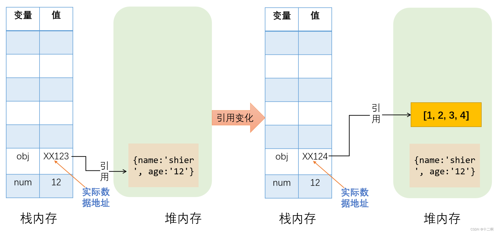

8. **javascript的执行机制**

   javascript不支持多线程，通过事件循环(event loop)机制来实现异步任务。

   - 任务队列

     > 一个**任务**就是指计划由标准机制来执行的任何 JavaScript，如程序的初始化、事件触发的回调等。 
     >
     > 除了使用事件，你还可以使用 [`setTimeout()`](https://developer.mozilla.org/zh-CN/docs/Web/API/setTimeout) 或者 [`setInterval()`](https://developer.mozilla.org/zh-CN/docs/Web/API/setInterval) 来添加任务**。**
     >
     > 所谓任务，浅显来说就是代码块开始执行的入口(确切地说，是函数栈的入口。

     > 主线程发起如果一个异步请求，相应的工作线程就接收这个请求并进行处理，期间，主线程发完请求之后就去干别的事情去了。等到工作线程的处理有了结果，浏览器内部就分配一个线程（event table）出来，通知主线程，刚刚发起的异步请求有了结果（这个通知过程其实是将回调函数推入消息队列（event queue）中，也叫事件队列，也叫任务队列），等到主线程处理完了当前调用栈中的任务，就会从这个消息队列中读取消息，也就是调用回调。这样就完成了一次异步操作。
     >
     > 而javascript执行代码的机制就是不断地从判断主线程是否为空，为空就读取消息队列（event queue）的回调并执行的过程。

     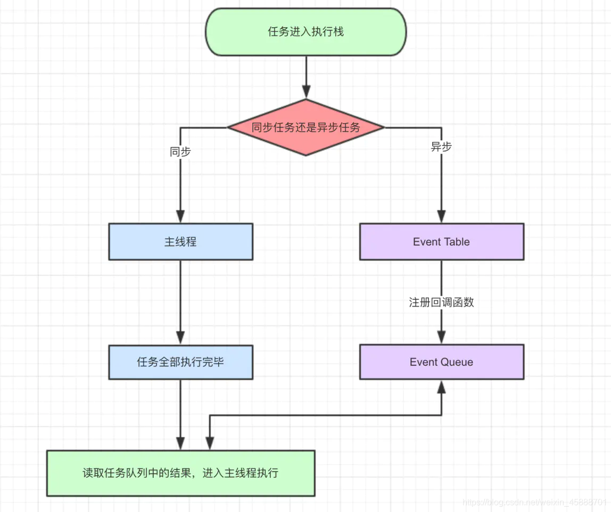

   - 宏任务和微任务

     - **宏任务**可以理解为每次执行栈执行的代码就是一个宏任务（包括每次从事件队列中获取一个事件回调并放到执行栈中执行）。

       浏览器为了让 JS 内部宏任务 与 DOM 操作能够有序的执行，会在一个宏任务执行结束后，在下一个宏任务执行开始前，对页面进行重新渲染。

       宏任务包含：

       1. script(整体代码)
       2. setTimeout、setInterval
       3. I/O
       4. UI交互事件
       5. MessageChannel 等。

     - **微任务**可以理解是在当前任务执行结束后需要立即执行的任务。也就是说，在当前任务后，在渲染之前，执行清空微任务。

       所以它的响应速度相比宏任务会更快，因为无需等待 UI 渲染。

       微任务包含：

       1. Promise.then
       2. MutaionObserver
       3. process.nextTick(Node.js 环境)等。

   - 执行顺序

     1. 先执行主线程；
     2. 遇到宏任务（macrotask）放到宏队列（macrotask）;
     3. 遇到微任务（microtask）放到微队列（microtask）;
     4. 主线程执行完毕；
     5. 执行微队列（microtask，清空微队列），微队列（microtask）执行完毕；
     6. 执行一次宏队列（macrotask）中的一个任务，执行完毕；
     7. 执行微队列（microtask，清空微队列），执行完毕；
     8. 依次循环……

     一个例子：

     ```js
     console.log('start')
     setTimeout(() => {
       console.log('s1')
       Promise.resolve().then(() => {
         console.log('p2')
       })
       Promise.resolve().then(() => {
         console.log('p3')
       })
     })
     
     Promise.resolve().then(() => {
       console.log('p1')
       setTimeout(() => {
         console.log('s2')
       })
       setTimeout(() => {
         console.log('s3')
       })
     })
     console.log('end')
     
     //执行结果依次为
     start
     end
     p1
     s1
     p2
     p3
     s2
     s3
     ```

     

9. **垃圾回收机制**

   > 垃圾回收其实主要是堆内存变量的回收。

   由于垃圾回收很消耗资源，且JavaScript又是单线程执行，因此垃圾回收策略采用了设计策略来避免性能占用过高。

   1. 新生代区和老生代区

      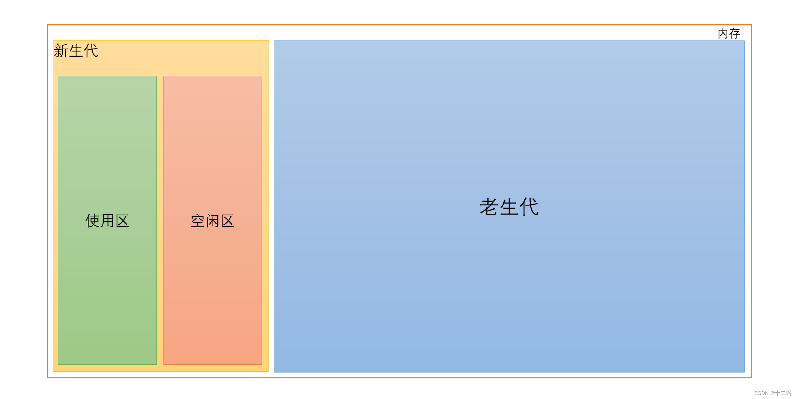

      - 新生代区——副垃圾回收器

        新生代区的内存占用较小，存放的是新变量，可能会不稳定。在程序执行时，新声明赋值的变量会进入新生代区。内存回收采用Scanvenge机制，即拥有两组内存：from区（对象区）和to区（空闲区）。from区存放还未被回收整理的区域，在某个垃圾回收周期（比如from区快被占满），会递归遍历from区中的变量，将还在被使用的变量复制到to区，遍历完成后，清空from区，并将to区复制到from区。

      - 老生代区——主垃圾回收器

        老生代区内存空间较大，一般存放较稳定的变量。经过一定的判断策略，将新生代区中的变量认定为稳定变量，存放到老生代区中。

        有以下几种策略：

        1. 标记-清除：在变量进入执行环境时，标记为“进入环境”，当变量离开执行环境时。标记为“离开环境”，被标记“进入环境”的变量不会被回收
           被标记“离开环境”的变量则被回收
        2. 标记-整理：通过标清除的内存空间，会出现内存碎片，致使内存的使用效率降低，因此当发现”标记-清除“后，内存仍占用过高时，可使用标记-整理策略：将被标记的变量朝内存空间边界方向统一排列
        3. 引用计数统计：记录每个变量的引用次数，次数为0时代表不会再被引用，可被回收

        在实现垃圾回收时，JavaScript主线程会被占用，因此会造成所谓的全停顿（即阻塞，主线程卡顿），为了避免阻塞，采用了增量标记的方法：

        将每次垃圾回收，分为多次子垃圾回收流程，插针式的在各个代码运行期间执行。

        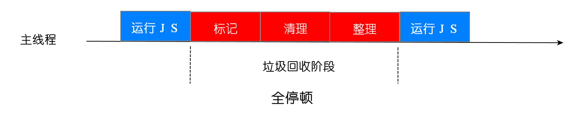

        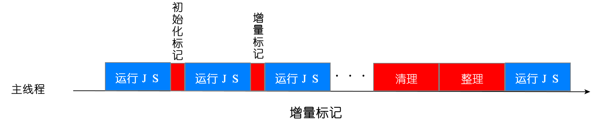

10. **内存泄漏**

   > 内存泄漏是指由于疏忽或错误造成程序未能释放已经不在使用的内存。

   1、被遗忘的计时器，写在函数内部，闭包内的；
   2、意外的全局变量{目前eslint会提示语法错误}；
   3、被遗忘的事件监听器，使用监听器后要移除监听器；
   4、被遗忘的ES6 set成员；
   5、被遗忘的订阅发布事件监听器；
   6、被遗忘的订阅发布事件监听器；
   7、被遗忘的闭包。

   查找内存泄漏的方法：利用开发者工具抓内存图等。

11. 宏内核与微内核？

### 2.语言特性

1. **原型 / 构造函数 / 实例**

   > - 原型`(prototype)`: 一个简单的对象，用于实现对象的 **属性继承**。可以简单的理解成对象的爹。在 Firefox 和 Chrome 中，每个`JavaScript`对象中都包含一个`__proto__` (非标准)的属性指向它爹(该对象的原型)，可`obj.__proto__`进行访问。
   >
   > - 构造函数: 可以通过`new`来 **新建一个对象** 的函数。
   >
   > - 实例: 通过构造函数和`new`创建出来的对象，便是实例。 **实例通过`__proto__`指向原型，通过`constructor`指向构造函数**。

   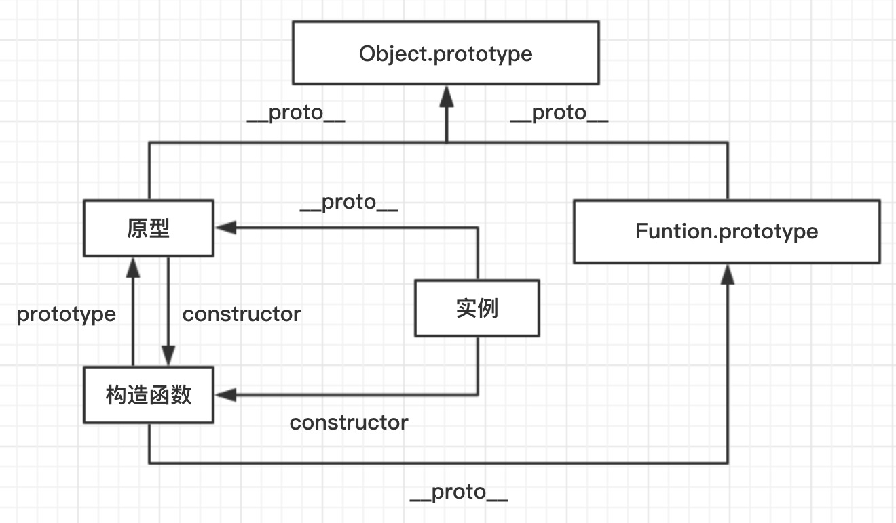

2. **原型链**

   原型链是由原型对象组成，每个对象都有 `__proto__` 属性，指向了创建该对象的构造函数的原型，**`__proto__` 将对象连接起来组成了原型链**。是一个用来**实现继承和共享属性**的有限的对象链。

   - **属性查找机制**: 当查找对象的属性时，如果实例对象自身不存在该属性，则沿着原型链往上一级查找，找到时则输出，不存在时，则继续沿着原型链往上一级查找，直至最顶级的原型对象`Object.prototype`，如还是没找到，则输出`undefined`；

   - **属性修改机制**: 只会修改实例对象本身的属性，如果不存在，则进行添加该属性，如果需要修改原型的属性时，则可以用: `b.prototype.x = 2`；但是这样会造成所有继承于该对象的实例的属性发生改变。

   **instanceof原理**

   能在实例的 **原型对象链** 中找到该构造函数的`prototype`属性所指向的 **原型对象**，就返回`true`。即:

   ```js
   // __proto__: 代表原型对象链
   instance.[__proto__...] === instance.constructor.prototype
   // return true
   ```

3. **闭包**

   > 闭包属于一种特殊的作用域，称为 **静态作用域**。它的定义可以理解为: **父函数被销毁** 的情况下，返回出的子函数的`[[scope]]`中仍然保留着父级的单变量对象和作用域链，因此可以继续访问到父级的变量对象，这样的函数称为闭包。

4. **对象的深拷贝**

   > 完全拷贝一个新对象，修改时原对象不再受到任何影响。

   - `JSON.parse(JSON.stringify(obj))`: 性能最快
     - 具有循环引用的对象时，报错
     - 当值为函数、`undefined`、或`symbol`时，无法拷贝  
   - 递归进行逐一赋值，需注意特殊的数值类型。参考[js对象的深拷贝](https://blog.csdn.net/qq_45272642/article/details/124840331)。

5. **new运算符的执行过程**

   1. 新生成一个对象；
   2. 链接到原型:  `obj.__proto__ = Con.prototype；`
   3. 绑定this: `apply`；
   4. 返回新对象(如果构造函数有自己 retrun 时，则返回该值)。

6. **改变this指向**

   this指向问题参考上文。

   改变this指向的方法：

   - `call: fn.call(target, 1, 2)`
   - `apply: fn.apply(target, [1, 2])`
   - `bind: fn.bind(target)(1,2)`

7. **防抖与节流**

   > 防抖与节流函数是一种最常用的 **高频触发优化方式**，能对性能有较大的帮助。

   - **防抖 (debounce)**: 将多次高频操作优化为只在最后一次执行，通常使用的场景是：用户输入，只需再输入完成后做一次输入校验即可。

     ```js
     function debounce(fn, wait, immediate) {
         let timer = null
     
         return function() {
             let args = arguments
             let context = this
     
             if (immediate && !timer) {
                 fn.apply(context, args)
             }
     
             if (timer) clearTimeout(timer)
             timer = setTimeout(() => {
                 fn.apply(context, args)
             }, wait)
         }
     }
     ```

   - **节流(throttle)**: 每隔一段时间后执行一次，也就是降低频率，将高频操作优化成低频操作，通常使用场景: 滚动条事件 或者 resize 事件，通常每隔 100~500 ms执行一次即可。

     ```js
     function throttle(fn, wait, immediate) {
         let timer = null
         let callNow = immediate
         
         return function() {
             let context = this,
                 args = arguments
     
             if (callNow) {
                 fn.apply(context, args)
                 callNow = false
             }
     
             if (!timer) {
                 timer = setTimeout(() => {
                     fn.apply(context, args)
                     timer = null
                 }, wait)
             }
         }
     }
     ```

8. **函数式编程**

   > 函数式编程是一种 **编程范式**，你可以理解为一种软件架构的思维模式。它有着独立一套理论基础与边界法则，追求的是 **更简洁、可预测、高复用、易测试**。

   - **常见的编程范式**:

     - 命令式编程(过程化编程): 更关心解决问题的步骤，一步步以语言的形式告诉计算机做什么；
     - 事件驱动编程: 事件订阅与触发，被广泛用于 GUI 的编程设计中；
     - 面向对象编程: 基于类、对象与方法的设计模式，拥有三个基础概念: 封装性、继承性、多态性；
     - 函数式编程
       - 换成一种更高端的说法，面向数学编程。怕不怕~🥴

   - **函数式编程的理念**:

     - **纯函数**(确定性函数): 是函数式编程的基础，可以使程序变得灵活，高度可拓展，可维护；

       - **优势**:
         - 完全独立，与外部解耦；
         - 高度可复用，在任意上下文，任意时间线上，都可执行并且保证结果稳定；
         - 可测试性极强；

       - **条件**:  
         - 不修改参数；
         - 不依赖、不修改任何函数外部的数据；
         - 完全可控，参数一样，返回值一定一样: 例如函数不能包含`new Date()`或者`Math.randon()`等这种不可控因素；
         - 引用透明；

       - 我们常用到的许多 API 或者工具函数，它们都具有着纯函数的特点， 如`split / join / map`；

     - **函数复合**: 将多个函数进行组合后调用，可以实现将一个个函数单元进行组合，达成最后的目标；

       - **扁平化嵌套**: 首先，我们一定能想到组合函数最简单的操作就是 包裹，因为在 JS 中，函数也可以当做参数:

         - `f(g(k(x)))`: 嵌套地狱，可读性低，当函数复杂后，容易让人一脸懵逼；
         - 理想的做法: `xxx(f, g, k)(x)`

       - **结果传递**: 如果想实现上面的方式，那也就是`xxx`函数要实现的便是: 执行结果在各个函数之间的执行传递；

         - 这时我们就能想到一个原生提供的数组方法: `reduce`，它可以按数组的顺序依次执行，传递执行结果；

         - 所以我们就能够实现一个方法`pipe`，用于函数组合:

           ```js
           // ...fs: 将函数组合成数组；
           // Array.prototype.reduce 进行组合；
           // p: 初始参数；
           const pipe = (...fs) => p => fs.reduce((v, f) => f(v), p)
           ```

       - **使用**: 实现一个 驼峰命名 转 中划线命名 的功能:

         ```js
         // 'Guo DongDong' --> 'guo-dongdong'
         // 函数组合式写法
         const toLowerCase = str => str.toLowerCase()
         const join = curry((str, arr) => arr.join(str))
         const split = curry((splitOn, str) => str.split(splitOn));
         
         const toSlug = pipe(
         	toLowerCase,	
         	split(' '),
         	join('_'),
         	encodeURIComponent,
           );
           console.log(toSlug('Guo DongDong'))
         ```

       - **好处**:

         - 隐藏中间参数，不需要临时变量，避免了这个环节的出错几率；

         - 只需关注每个纯函数单元的稳定，不再需要关注命名，传递，调用等；

         - 可复用性强，任何一个函数单元都可被任意复用和组合；

         - 可拓展性强，成本低，例如现在加个需求，要查看每个环节的输出:

           ```js
           const log = curry((label, x) => {
           	console.log(`${ label }: ${ x }`);
           	return x;
           });
           
           const toSlug = pipe(
           	toLowerCase,	
           	log('toLowerCase output'),
           	split(' '),
           	log('split output'),
           	join('_'),
           	log('join output'),
           	encodeURIComponent,
           );
           ```

     - **数据不可变性**(immutable): 这是一种数据理念，也是函数式编程中的核心理念之一:

       - **倡导**: 一个对象再被创建后便不会再被修改。当需要改变值时，是返回一个全新的对象，而不是直接在原对象上修改；
       - **目的**: 保证数据的稳定性。避免依赖的数据被未知地修改，导致了自身的执行异常，能有效提高可控性与稳定性；
       - 并不等同于`const`。使用`const`创建一个对象后，它的属性仍然可以被修改；
       - 更类似于`Object.freeze`: 冻结对象，但`freeze`仍无法保证深层的属性不被串改；
       - `immutable.js`: js 中的数据不可变库，它保证了数据不可变，在 React 生态中被广泛应用，大大提升了性能与稳定性；
         - `trie`数据结构: 
           - 一种数据结构，能有效地深度冻结对象，保证其不可变；
           - **结构共享**: 可以共用不可变对象的内存引用地址，减少内存占用，提高数据操作性能；

     - 避免不同函数之间的 **状态共享**，数据的传递使用复制或全新对象，遵守数据不可变原则；

     - 避免从函数内部 **改变外部状态**，例如改变了全局作用域或父级作用域上的变量值，可能会导致其它单位错误；

     - 避免在单元函数内部执行一些 **副作用**，应该将这些操作抽离成更独立的工具单元；

       - 日志输出
       - 读写文件
       - 网络请求
       - 调用外部进程
       - 调用有副作用的函数 

   - **高阶函数**: 是指以函数为参数，返回一个新的增强函数的一类函数，它通常用于:

     - 将逻辑行为进行 **隔离抽象**，便于快速复用，如处理数据，兼容性等；
     - **函数组合**，将一系列单元函数列表组合成功能更强大的函数；
     - **函数增强**，快速地拓展函数功能，

   - **函数式编程的好处**:

     - 函数副作用小，所有函数独立存在，没有任何耦合，复用性极高；
     - 不关注执行时间，执行顺序，参数，命名等，能专注于数据的流动与处理，能有效提高稳定性与健壮性；
     - 追求单元化，粒度化，使其重构和改造成本降低，可维护、可拓展性较好；
     - 更易于做单元测试。

9. **函数柯里化**

   > 在一个函数中，首先填充几个参数，然后再返回一个新的函数的技术，称为函数的柯里化，是函数式编程范式的一种应用。通常可用于在不侵入函数的前提下，为函数 **预置通用参数**，供多次重复调用。

   ```js
   const add = function add(x) {
   	return function (y) {
   		return x + y
   	}
   }
   
   const add1 = add(1)
   
   add1(2) === 3
   add1(20) === 21
   ```


### 3.数据类型

1. **类型判断**

   判断 Target 的类型，单单用 typeof 并无法完全满足，这其实并不是 bug，本质原因是 JS 的万物皆对象的理论。因此要真正完美判断时，我们需要区分对待: 

   - 基本类型(`null`): 使用 `String(null)`
   - 基本类型(`string / number / boolean / undefined`) + `function`: 直接使用 `typeof`即可
   - 其余引用类型(`Array / Date / RegExp Error`): 调用`toString`后根据`[object XXX]`进行判断

   很稳的判断封装:

   ```js
   let class2type = {}
   'Array Date RegExp Object Error'.split(' ').forEach(e => class2type[ '[object ' + e + ']' ] = e.toLowerCase()) 
   
   function type(obj) {
       if (obj == null) return String(obj)
       return typeof obj === 'object' ? class2type[ Object.prototype.toString.call(obj) ] || 'object' : typeof obj
   }
   ```

2. **类型转换**

   - 隐式转换

     - -、*、/、% ：一律转换成数值后计算；
     - +： 
       - 数字 + 字符串 = 字符串， 运算顺序是从左到右；
       - 数字 + 对象， 优先调用对象的`valueOf` -> `toString`；
       - 数字 + `boolean/null` -> 数字；
       - 数字 + `undefined` -> `NaN；；
     - `[1].toString() === '1'`；
     - `{}.toString() === '[object object]'`；
     - `NaN` !== `NaN` 、`+undefined 为 NaN`；

   - 显示转换

     强制类型转换，如`parseInt、Number、toString`等。

3. **String、Array的常用方法**

   - String

     | 方法                                                         | 描述                                                 |
     | :----------------------------------------------------------- | :--------------------------------------------------- |
     | [charAt()](https://www.w3school.com.cn/jsref/jsref_charAt.asp) | 返回在指定位置的字符,等价于`str[i]`。                |
     | [charCodeAt()](https://www.w3school.com.cn/jsref/jsref_charCodeAt.asp) | 返回在指定的位置的字符的 Unicode 编码。              |
     | [concat()](https://www.w3school.com.cn/jsref/jsref_concat_string.asp) | 连接字符串。                                         |
     | [indexOf()](https://www.w3school.com.cn/jsref/jsref_indexOf.asp) | 检索字符串。                                         |
     | [lastIndexOf()](https://www.w3school.com.cn/jsref/jsref_lastIndexOf.asp) | 从后向前搜索字符串。                                 |
     | [match()](https://www.w3school.com.cn/jsref/jsref_match.asp) | 找到一个或多个正则表达式的匹配。                     |
     | [replace()](https://www.w3school.com.cn/jsref/jsref_replace.asp) | 替换与正则表达式匹配的子串。                         |
     | [slice()](https://www.w3school.com.cn/jsref/jsref_slice_string.asp) | 提取字符串的片断，并在新的字符串中返回被提取的部分。 |
     | [small()](https://www.w3school.com.cn/jsref/jsref_small.asp) | 使用小字号来显示字符串。                             |
     | [split()](https://www.w3school.com.cn/jsref/jsref_split.asp) | 把字符串分割为字符串数组。                           |
     | [strike()](https://www.w3school.com.cn/jsref/jsref_strike.asp) | 使用删除线来显示字符串。                             |
     | [toLocaleLowerCase()](https://www.w3school.com.cn/jsref/jsref_toLocaleLowerCase.asp) | 把字符串转换为小写。                                 |
     | [toLocaleUpperCase()](https://www.w3school.com.cn/jsref/jsref_toLocaleUpperCase.asp) | 把字符串转换为大写。                                 |
     | [toLowerCase()](https://www.w3school.com.cn/jsref/jsref_toLowerCase.asp) | 把字符串转换为小写。                                 |
     | [toUpperCase()](https://www.w3school.com.cn/jsref/jsref_toUpperCase.asp) | 把字符串转换为大写。                                 |

   - Array

     | 方法                                                         | 描述                                         |
     | :----------------------------------------------------------- | :------------------------------------------- |
     | [concat()](https://www.w3school.com.cn/jsref/jsref_concat_array.asp) | 连接两个或多个数组，并返回已连接数组的副本。 |
     | [every()](https://www.w3school.com.cn/jsref/jsref_every.asp) | 检查数组中的每个元素是否通过测试。           |
     | [fill()](https://www.w3school.com.cn/jsref/jsref_fill.asp)   | 用静态值填充数组中的元素。                   |
     | [filter()](https://www.w3school.com.cn/jsref/jsref_filter.asp) | 使用数组中通过测试的每个元素创建新数组。     |
     | [find()](https://www.w3school.com.cn/jsref/jsref_find.asp)   | 返回数组中第一个通过测试的元素的值。         |
     | [findIndex()](https://www.w3school.com.cn/jsref/jsref_findindex.asp) | 返回数组中通过测试的第一个元素的索引。       |
     | [forEach()](https://www.w3school.com.cn/jsref/jsref_foreach.asp) | 为每个数组元素调用函数。                     |
     | [from()](https://www.w3school.com.cn/jsref/jsref_from.asp)   | 从对象创建数组。                             |
     | [includes()](https://www.w3school.com.cn/jsref/jsref_includes_array.asp) | 检查数组是否包含指定的元素。                 |
     | [indexOf()](https://www.w3school.com.cn/jsref/jsref_indexof_array.asp) | 在数组中搜索元素并返回其位置。               |
     | [isArray()](https://www.w3school.com.cn/jsref/jsref_isarray.asp) | 检查对象是否为数组。                         |
     | [join()](https://www.w3school.com.cn/jsref/jsref_join.asp)   | 将数组的所有元素连接成一个字符串。           |
     | [keys()](https://www.w3school.com.cn/jsref/jsref_keys.asp)   | 返回 Array Iteration 对象，包含原始数组的键. |
     | [lastIndexOf()](https://www.w3school.com.cn/jsref/jsref_lastindexof_array.asp) | 在数组中搜索元素，从末尾开始，并返回其位置。 |
     | [map()](https://www.w3school.com.cn/jsref/jsref_map.asp)     | 使用为每个数组元素调用函数的结果创建新数组。 |
     | [pop()](https://www.w3school.com.cn/jsref/jsref_pop.asp)     | 删除数组的最后一个元素，并返回该元素。       |
     | [push()](https://www.w3school.com.cn/jsref/jsref_push.asp)   | 将新元素添加到数组的末尾，并返回新的长度。   |
     | [reverse()](https://www.w3school.com.cn/jsref/jsref_reverse.asp) | 反转数组中元素的顺序。                       |
     | [shift()](https://www.w3school.com.cn/jsref/jsref_shift.asp) | 删除数组的第一个元素，并返回该元素。         |
     | [slice()](https://www.w3school.com.cn/jsref/jsref_slice_array.asp) | 选择数组的一部分，并返回新数组。             |
     | [some()](https://www.w3school.com.cn/jsref/jsref_some.asp)   | 检查数组中的任何元素是否通过测试。           |
     | [sort()](https://www.w3school.com.cn/jsref/jsref_sort.asp)   | 对数组的元素进行排序。                       |
     | [splice()](https://www.w3school.com.cn/jsref/jsref_splice.asp) | 从数组中添加/删除元素。                      |
     | [toString()](https://www.w3school.com.cn/jsref/jsref_tostring_array.asp) | 将数组转换为字符串，并返回结果。             |
     | [unshift()](https://www.w3school.com.cn/jsref/jsref_unshift.asp) | 将新元素添加到数组的开头，并返回新的长度。   |

   - Object

     | 方法                                                         | 描述                                                         |
     | :----------------------------------------------------------- | :----------------------------------------------------------- |
     | [`create()`](https://developer.mozilla.org/zh-CN/docs/Web/JavaScript/Reference/Global_Objects/Object/create) | 用于创建一个新对象，使用现有的对象来作为新创建对象的原型（prototype）。 |
     | [`defineProperty()`](https://developer.mozilla.org/zh-CN/docs/Web/JavaScript/Reference/Global_Objects/Object/defineProperty) | 给对象添加一个属性并指定该属性的配置。                       |
     | [`defineProperties()`](https://developer.mozilla.org/zh-CN/docs/Web/JavaScript/Reference/Global_Objects/Object/defineProperties) | 给对象添加多个属性并分别指定它们的配置。                     |
     | [`entries()`](https://developer.mozilla.org/zh-CN/docs/Web/JavaScript/Reference/Global_Objects/Object/entries) | 返回给定对象自身可枚举属性的 `[key, value]` 数组。           |
     | [`is()`](https://developer.mozilla.org/zh-CN/docs/Web/JavaScript/Reference/Global_Objects/Object/is) | 比较两个值是否相同。所有 NaN 值都相等（这与==和===不同）。   |
     | [`keys()`](https://developer.mozilla.org/zh-CN/docs/Web/JavaScript/Reference/Global_Objects/Object/keys) | 返回一个包含所有给定对象**自身**可枚举属性名称的数组。       |
     | [`values()`](https://developer.mozilla.org/zh-CN/docs/Web/JavaScript/Reference/Global_Objects/Object/values) | 返回给定对象自身可枚举值的数组。                             |

### 4.ES6

1. **变量与表达式**

   1. 变量声明

      - `let / const`: 块级作用域、不存在变量提升、暂时性死区、不允许重复声明；
      - `const`: 声明常量，无法修改。

   2. 解构赋值

   3. Symbol类型

      > 表示独一无二的值，最大的用法是用来定义对象的唯一属性名。

2. 内置对象

   1. `Set/Map`: 新的哈希表数据结构。

      - Map

        1. Map与数组的转化

           ```js
           var kvArray = [["key1", "value1"], ["key2", "value2"]];
            
           // Map 构造函数可以将一个 二维 键值对数组转换成一个 Map 对象
           var myMap = new Map(kvArray);
            
           // 使用 Array.from 函数可以将一个 Map 对象转换成一个二维键值对数组
           var outArray = Array.from(myMap);
           ```

        2. Map的克隆

           ```js
           var myMap1 = new Map([["key1", "value1"], ["key2", "value2"]]);
           var myMap2 = new Map(myMap1);
            
           console.log(myMap1 === myMap2); 
           // 打印 false。 Map 对象构造函数生成实例，迭代出新的对象。
           ```

        3. Map 的合并

           ```js
           var first = new Map([[1, 'one'], [2, 'two'], [3, 'three'],]);
           var second = new Map([[1, 'uno'], [2, 'dos']]);
            
           // 合并两个 Map 对象时，如果有重复的键值，则后面的会覆盖前面的，对应值即 uno，dos， three
           var merged = new Map([...first, ...second]);
           ```

      - Set

        1. 特殊值

           Set 对象存储的值总是唯一的，所以需要判断两个值是否恒等。有几个特殊值需要特殊对待：

           - +0 与 -0 在存储判断唯一性的时候是恒等的，所以不重复；
           - undefined 与 undefined 是恒等的，所以不重复；
           - NaN 与 NaN 是不恒等的，但是在 Set 中只能存一个，不重复。

        2. Set与数组的转换

           ```js
           // Array 转 Set
           var mySet = new Set(["value1", "value2", "value3"]);
           // 用...操作符，将 Set 转 Array
           var myArray = [...mySet];
           
           // String 转 Set
           var mySet = new Set('hello');  // Set(4) {"h", "e", "l", "o"}
           // 注：Set 中 toString 方法是不能将 Set 转换成 String
           ```

        3. Set的用途

           - 数组去重

             ```js
             var mySet = new Set([1, 2, 3, 4, 4]);
             [...mySet]; // [1, 2, 3, 4]
             ```

           - 并集

             ```js
             var a = new Set([1, 2, 3]);
             var b = new Set([4, 3, 2]);
             var union = new Set([...a, ...b]); // {1, 2, 3, 4}
             ```

           - 交集

             ```js
             var a = new Set([1, 2, 3]);
             var b = new Set([4, 3, 2]);
             var intersect = new Set([...a].filter(x => b.has(x))); // {2, 3}
             ```

           - 差集

             ```js
             var a = new Set([1, 2, 3]);
             var b = new Set([4, 3, 2]);
             var difference = new Set([...a].filter(x => !b.has(x))); // {1}
             ```

   2. Proxy与Reflect

      参考自https://www.runoob.com/w3cnote/es6-reflect-proxy.html。

      - Proxy

        > Proxy 可以对目标对象的读取、函数调用等操作进行**拦截**，然后进行操作处理。它不直接操作对象，而是像代理模式，通过对象的代理对象进行操作，在进行这些操作时，可以添加一些需要的额外操作。

        - 基本用法：

        ```js
        let target = {
            name: 'Tom',
            age: 24
        }
        let handler = {
            get: function(target, key) {
                console.log('getting '+key);
                return target[key]; // 不是target.key
            },
            set: function(target, key, value) {
                console.log('setting '+key);
                target[key] = value;
            }
        }
        let proxy = new Proxy(target, handler)
        ```

        - 捕获器的用法（hander中的方法）：

          1. `get(target, propKey, receiver)`

             用于 target 对象上 propKey 的读取操作。

             > get() 方法可以继承（原型链继承）。

             > 第四个参数 receiver 表示原始操作行为所在对象，一般是 Proxy 实例本身。
             >
             > receiver参数的作用：如果我们的源对象（obj）有**setter、getter的访问器属性**，那么可以**通过receiver来改原对象变里面的this**。
             >
             > 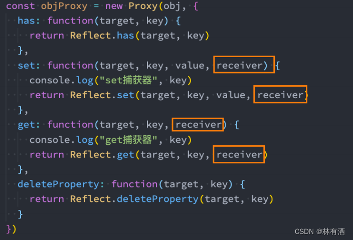

          2. `set(target, propKey, value, receiver)`

             用于拦截 target 对象上的 propKey 的赋值操作。如果目标对象自身的某个属性，不可写且不可配置，那么set方法将不起作用。

          3. `apply(target, ctx, args)`

             用于拦截函数的调用、call 和 applay操作。target 表示目标对象，ctx 表示目标对象上下文，args 表示目标对象的参数数组。

             ```js
             function sub(a, b){
                 return a - b;
             }
             let handler = {
                 apply: function(target, ctx, args){
                     console.log('handle apply');
                     return Reflect.apply(...arguments);
                 }
             }
             let proxy = new Proxy(sub, handler)
             ```

          4. `has(target, propKey)`

             用于拦截 HasProperty 操作，即在判断 target 对象是否存在 propKey 属性时，会被这个方法拦截。**此方法不判断一个属性是对象自身的属性，还是继承的属性。**注意：此方法不拦截 for ... in 循环。

             ```js
             let  handler = {
                 has: function(target, propKey){
                     console.log("handle has");
                     return propKey in target;
                 }
             }
             let exam = {name: "Tom"}
             let proxy = new Proxy(exam, handler)
             'name' in proxy
             // handle has
             // true
             ```

          5. `construct(target, args)`

             用于拦截 new 命令。返回值必须为对象。

             ```js
             let handler = {
                 construct: function (target, args, newTarget) {
                     console.log('handle construct')
                     return Reflect.construct(target, args, newTarget)  
                 }
             }
             class Exam { 
                 constructor (name) {  
                     this.name = name 
                 }
             }
             let ExamProxy = new Proxy(Exam, handler)
             let proxyObj = new ExamProxy('Tom')
             console.log(proxyObj)
             // handle construct
             // exam {name: "Tom"}
             ```

          6. `deleteProperty(target, propKey)`

             用于拦截 delete 操作，如果这个方法抛出**错误**或者返回 **false** ，propKey 属性就无法被 delete 命令删除。

          7. `defineProperty(target, propKey, propDesc)`

             用于拦截 `Object.defineProperty`，若目标对象不可扩展，增加目标对象上不存在的属性会报错；若属性不可写或不可配置，则不能改变这些属性。

             ```js
             let handler = {
                 defineProperty: function(target, propKey, propDesc){
                     console.log("handle defineProperty");
                     return true;
                 }
             }
             let target = {}
             let proxy = new Proxy(target, handler)
             proxy.name = "Tom"
             // handle defineProperty
             target
             // {name: "Tom"}
              
             // defineProperty 返回值为false，添加属性操作无效
             let handler1 = {
                 defineProperty: function(target, propKey, propDesc){
                     console.log("handle defineProperty");
                     return false;
                 }
             }
             let target1 = {}
             let proxy1 = new Proxy(target1, handler1)
             proxy1.name = "Jerry"
             target1
             // {}
             ```

          8. `getOwnPropertyDescriptor(target, propKey)`

             拦截 `Object.getOwnPropertyDescriptor()` 。

          9. `getPrototypeOf(target)`

             拦截获取对象原型的操作。包括以下操作：

             - `Object.prototype._proto_`
             - `Object.prototype.isPrototypeOf()`
             - `Object.getPrototypeOf()`
             - `Reflect.getPrototypeOf()`
             - `instanceof`

          10. `isExtensible(target)`

              拦截 `Object.isExtensible` 操作。该方法只能返回布尔值，否则返回值会被自动转为布尔值。

          11. `ownKeys(target)`

              拦截对象自身属性的读取操作。主要包括以下操作：

              - `Object.getOwnPropertyNames()`
              - `Object.getOwnPropertySymbols()`
              - `Object.keys()`
              - `for...in`

          12. `preventExtensions(target)`

              拦截 Object.preventExtensions 操作。

          13. `setPrototypeOf(target, proto)`

              拦截 Object.setPrototypeOf 方法。

          14. `Proxy.revocable()`

              用于返回一个可取消的 Proxy 实例。

              ```js
              let {proxy, revoke} = Proxy.revocable({}, {});
              proxy.name = "Tom";
              revoke();
              proxy.name 
              // TypeError: Cannot perform 'get' on a proxy that has been revoked
              ```

      - Reflect

        > ES6 中将 Object 的一些明显属于语言内部的方法移植到了 Reflect 对象上（当前某些方法会同时存在于 Object 和 Reflect 对象上）。

        - 静态方法

          1. `Reflect.get(target, name, receiver)`

             查找并返回 target 对象的 name 属性。

             ```js
             let exam = {
                 name: "Tom",
                 age: 24,
                 get info(){
                     return this.name + this.age;
                 }
             }
             Reflect.get(exam, 'name'); // "Tom"
              
             // 当 target 对象中存在 name 属性的 getter 方法， getter 方法的 this 会绑定 // receiver
             let receiver = {
                 name: "Jerry",
                 age: 20
             }
             Reflect.get(exam, 'info', receiver); // Jerry20
              
             // 当 name 为不存在于 target 对象的属性时，返回 undefined
             Reflect.get(exam, 'birth'); // undefined
              
             // 当 target 不是对象时，会报错
             Reflect.get(1, 'name'); // TypeError
             ```

          2. `Reflect.set(target, name, value, receiver)`

             将 target 的 name 属性设置为 value。返回值为 boolean ，true 表示修改成功，false 表示失败。当 target 为不存在的对象时，会报错。

             ```js
             let exam = {
                 name: "Tom",
                 age: 24,
                 set info(value){
                     return this.age = value;
                 }
             }
             exam.age; // 24
             Reflect.set(exam, 'age', 25); // true
             exam.age; // 25
              
             // value 为空时会将 name 属性清除
             Reflect.set(exam, 'age', ); // true
             exam.age; // undefined
              
             // 当 target 对象中存在 name 属性 setter 方法时，setter 方法中的 this 会绑定 // receiver , 所以修改的实际上是 receiver 的属性,
             let receiver = {
                 age: 18
             }
             Reflect.set(exam, 'info', 1, receiver); // true
             receiver.age; // 1
              
             let receiver1 = {
                 name: 'oppps'
             }
             Reflect.set(exam, 'info', 1, receiver1);
             receiver1.age; // 1
             ```

          3. `Reflect.has(obj, name)`

             是 name in obj 指令的函数化，用于查找 name 属性在 obj 对象中是否存在。返回值为 boolean。如果 obj 不是对象则会报错 TypeError。

          4. `Reflect.deleteProperty(obj, property)`

             是 delete obj[property] 的函数化，用于删除 obj 对象的 property 属性，返回值为 boolean。如果 obj 不是对象则会报错 TypeError。

          5. `Reflect.construct(obj, args)`

             等同于 new target(...args)。

          6. `Reflect.getPrototypeOf(obj)`

             用于读取 obj 的 _proto_ 属性。在 obj 不是对象时不会像 Object 一样把 obj 转为对象，而是会报错。

          7. `Reflect.setPrototypeOf(obj, newProto)`

             用于设置目标对象的 prototype。

          8. `Reflect.apply(func, thisArg, args)`

             等同于 Function.prototype.apply.call(func, thisArg, args) 。func 表示目标函数；thisArg 表示目标函数绑定的 this 对象；args 表示目标函数调用时传入的参数列表，可以是数组或类似数组的对象。若目标函数无法调用，会抛出 TypeError 。

             ```js
             Reflect.apply(Math.max, Math, [1, 3, 5, 3, 1]); // 5
             ```

          9. `Reflect.defineProperty(target, propertyKey, attributes)`

             用于为目标对象定义属性。如果 target 不是对象，会抛出错误。

             ```js
             let myDate= {}
             Reflect.defineProperty(MyDate, 'now', {
               value: () => Date.now()
             }); // true
              
             const student = {};
             Reflect.defineProperty(student, "name", {value: "Mike"}); // true
             student.name; // "Mike"
             ```

          10. `Reflect.getOwnPropertyDescriptor(target, propertyKey)`

              用于得到 target 对象的 propertyKey 属性的描述对象。在 target 不是对象时，会抛出错误表示参数非法，不会将非对象转换为对象。

              ```js
              var exam = {}
              Reflect.defineProperty(exam, 'name', {
                value: true,
                enumerable: false,
              })
              Reflect.getOwnPropertyDescriptor(exam, 'name')
              // { configurable: false, enumerable: false, value: true, writable: false}
               
              // propertyKey 属性在 target 对象中不存在时，返回 undefined
              Reflect.getOwnPropertyDescriptor(exam, 'age') // undefined
              ```

          11. `Reflect.isExtensible(target)`

              用于判断 target 对象是否可扩展。返回值为 boolean 。如果 target 参数不是对象，会抛出错误。

          12. `Reflect.preventExtensions(target)`

              用于让 target 对象变为不可扩展。如果 target 参数不是对象，会抛出错误。

          13. `Reflect.ownKeys(target)`

              用于返回 target 对象的所有属性，等同于 Object.getOwnPropertyNames 与Object.getOwnPropertySymbols 之和。

              ```js
              var exam = {
                name: 1,
                [Symbol.for('age')]: 4
              }
              Reflect.ownKeys(exam) // ["name", Symbol(age)]
              ```

      - 组合使用

        ```js
        let exam = {
            name: "Tom",
            age: 24
        }
        let handler = {
            get: function(target, key){
                console.log("getting "+key);
                return Reflect.get(target,key);
            },
            set: function(target, key, value){
                console.log("setting "+key+" to "+value)
                Reflect.set(target, key, value);
            }
        }
        let proxy = new Proxy(exam, handler)
        proxy.name = "Jerry"
        proxy.name
        // setting name to Jerry
        // getting name
        // "Jerry"
        ```

      - 应用场景

        1. 实现观察者模式

           ```js
           // 定义 Set 集合
           const queuedObservers = new Set();
           // 把观察者函数都放入 Set 集合中
           const observe = fn => queuedObservers.add(fn);
           // observable 返回原始对象的代理，拦截赋值操作
           const observable = obj => new Proxy(obj, {set});
           function set(target, key, value, receiver) {
             // 获取对象的赋值操作
             const result = Reflect.set(target, key, value, receiver);
             // 执行所有观察者
             queuedObservers.forEach(observer => observer());
             // 执行赋值操作
             return result;
           }
           ```

   3. 其他拓展

      - String方法

        1. 子串的识别

           - **includes()**：返回布尔值，判断是否找到参数字符串。

           - **startsWith()**：返回布尔值，判断参数字符串是否在原字符串的头部。

           - **endsWith()**：返回布尔值，判断参数字符串是否在原字符串的尾部。

             以上三个方法都可以接受两个参数，需要搜索的字符串，和可选的搜索起始位置索引。

             ```js
             let string = "apple,banana,orange";
             string.includes("banana");     // true
             string.startsWith("apple");    // true
             string.endsWith("apple");      // false
             string.startsWith("banana",6)  // true
             ```

        2. 字符串重复

           `repeat()`：返回新的字符串，表示将字符串重复指定次数返回。

           ```js
           console.log("Hello,".repeat(2));  // "Hello,Hello,"
           ```

        3. 字符串补全

           - **padStart**：返回新的字符串，表示用参数字符串从头部（左侧）补全原字符串。
           - **padEnd**：返回新的字符串，表示用参数字符串从尾部（右侧）补全原字符串。

           以上两个方法接受两个参数，第一个参数是指定生成的字符串的最小长度，第二个参数是用来补全的字符串。如果没有指定第二个参数，默认用空格填充。

           ```js
           console.log("h".padStart(5,"o"));  // "ooooh"
           console.log("h".padEnd(5,"o"));    // "hoooo"
           console.log("h".padStart(5));      // "    h"
           ```

        4. 模板字符串

           模板字符串相当于加强版的字符串，用反引号 **`**,除了作为普通字符串，还可以用来定义多行字符串，还可以在字符串中加入变量和表达式。

        5. 标签模板

           ```js
           function f(stringArr,...values){
            let result = "";
            for(let i=0;i<stringArr.length;i++){
             result += stringArr[i];
             if(values[i]){
              result += values[i];
                   }
               }
            return result;
           }
           let name = 'Mike';
           let age = 27;
           f`My Name is ${name},I am ${age+1} years old next year.`;
           // "My Name is Mike,I am 28 years old next year."
            
           f`My Name is ${name},I am ${age+1} years old next year.`;
           // 等价于
           f(['My Name is',',I am ',' years old next year.'],'Mike',28);
           ```

      - 数组方法

        1. 数组缓冲区

           > 数组缓冲区是内存中的一段地址。

           ```js
           let buffer = new ArrayBuffer(10);
           ```

        2. 视图

           > 视图是用来操作内存的接口。
           >
           > 视图可以操作数组缓冲区或缓冲区字节的子集,并按照其中一种数值数据类型来读取和写入数据。
           >
           > DataView 类型是一种通用的数组缓冲区视图,其支持所有8种数值型数据类型。

           ```js
           // 默认 DataView 可操作数组缓冲区全部内容
           let buffer = new ArrayBuffer(10);
               dataView = new DataView(buffer); 
           dataView.setInt8(0,1);
           console.log(dataView.getInt8(0)); // 1
            
           // 通过设定偏移量(参数2)与长度(参数3)指定 DataView 可操作的字节范围
           let buffer1 = new ArrayBuffer(10);
               dataView1 = new DataView(buffer1, 0, 3);
           dataView1.setInt8(5,1); // RangeError
           ```

        3. 定型数组

           > 数组缓冲区的特定类型的视图。
           >
           > 可以强制使用特定的数据类型，而不是使用通用的 DataView 对象来操作数组缓冲区。

           通过数组缓冲区生成：

           ```js
           let buffer = new ArrayBuffer(10),
               view = new Int8Array(buffer);
           console.log(view.byteLength); // 10
           ```

           通过构造函数生成：

           ```js
           let view = new Int32Array(10);
           console.log(view.byteLength); // 40
           console.log(view.length);     // 10
           ```

3. 运算符与语句

   1. 箭头函数

      略。

   2. class类

      略。

4. 异步编程

   1. Promise对象

      > 是异步编程的一种解决方案。

      关于如何手写一个Promise对象？。

      1. Promise的状态

         Promise 异步操作有三种状态：pending（进行中）、fulfilled（已成功）和 rejected（已失败）。除了异步操作的结果，任何其他操作都无法改变这个状态。

         Promise 对象只有：从 pending 变为 fulfilled 和从 pending 变为 rejected 的状态改变。只要处于 fulfilled 和 rejected ，状态就不会再变了即 resolved（已定型）。

         **缺点：**

         无法取消 Promise ，一旦新建它就会立即执行，无法中途取消。

         如果不设置回调函数，Promise 内部抛出的错误，不会反应到外部。

         当处于 pending 状态时，无法得知目前进展到哪一个阶段（刚刚开始还是即将完成）。

      2. `then`方法

         then 方法接收两个函数作为参数，第一个参数是 Promise 执行成功时的回调，第二个参数是 Promise 执行失败时的回调，两个函数只会有一个被调用。

      3. `catch`方法

         捕获promise中抛出的错误。

      4. `all`方法

         所有的promise**都**返回成功时当前的promise才返回成功，否则返回失败。

      5. `race`方法

         当其中的**某一个**promise返回结果时，就把此返回结果作为当前promise的返回结果。

      6. `Promise.resolve` 方法，`Promise.reject` 方法

         手动生成对应状态的promise对象。

   2. Generator函数

      参考自https://www.runoob.com/w3cnote/es6-generator.html。

      > ES6 新引入了 Generator 函数，可以通过 yield 关键字，把函数的执行流挂起，为改变执行流程提供了可能，从而为异步编程提供解决方案。

      其中 * 用来表示函数为 Generator 函数，yield 用来定义函数内部的状态。

      ```js
      function* func(){
       console.log("one");
       yield '1';
       console.log("two");
       yield '2'; 
       console.log("three");
       return '3';
      }
      ```

      - 执行机制

        调用 Generator 函数和调用普通函数一样，在函数名后面加上()即可，但是 Generator 函数不会像普通函数一样立即执行，而是返回一个指向内部状态对象的指针，所以要调用遍历器对象Iterator 的 `next` 方法，指针就会从函数头部或者上一次停下来的地方开始执行。

        ```js
        f.next();
        // one
        // {value: "1", done: false}
         
        f.next();
        // two
        // {value: "2", done: false}
         
        f.next();
        // three
        // {value: "3", done: true}
         
        f.next();
        // {value: undefined, done: true}
        ```

        1. `next` 方法

           一般情况下，next 方法不传入参数的时候，yield 表达式的返回值是 undefined 。当 next 传入参数的时候，该参数会作为上一步yield的返回值。

        2. `return` 方法

           return 方法返回给定值，并结束遍历 Generator 函数。return 方法提供参数时，返回该参数；不提供参数时，返回 undefined 。

   3. async & await函数

      - async

        1. 语法

           ```js
           async function name([param[, param[, ... param]]]) { statements }
           ```

           - name: 函数名称。
           - param: 要传递给函数的参数的名称。
           - statements: 函数体语句。

        2. 返回值

           async 函数返回一个 Promise 对象，可以使用 then 方法添加回调函数。

           ```js
           async function helloAsync(){
               return "helloAsync";
             }
             
           console.log(helloAsync())  // Promise {<resolved>: "helloAsync"}
            
           helloAsync().then(v=>{
              console.log(v);         // helloAsync
           })
           ```

           async 函数执行时，如果**遇到 await 就会先暂停执行** ，等到触发的异步操作完成后，恢复 async 函数的执行并返回解析值。

      - await

        1. 语法

           await 操作符用于等待一个 Promise 对象, 它只能在异步函数 async function 内部使用。

           ```js
           [return_value] = await expression;
           ```

        2. 返回值

           返回 Promise 对象的处理结果。如果等待的不是 Promise 对象，则返回该值本身。

           如果一个 Promise 被传递给一个 await 操作符，await 将等待 Promise 正常处理完成并返回其处理结果。

           ```js
           function testAwait (x) {
             return new Promise(resolve => {
               setTimeout(() => {
                 resolve(x);
               }, 2000);
             });
           }
            
           async function helloAsync() {
             var x = await testAwait ("hello world");
             console.log(x); 
           }
           helloAsync ();
           // hello world
           ```

           正常情况下，await 命令后面是一个 Promise 对象，它也可以跟其他值，如字符串，布尔值，数值以及普通函数。

           await针对所跟不同表达式的处理方式：

           - Promise 对象：await 会暂停执行，等待 Promise 对象 resolve，然后恢复 async 函数的执行并返回解析值。
           - 非 Promise 对象：直接返回对应的值。

5. 模块

   1. 特点

      - ES6 的模块自动开启严格模式，不管你有没有在模块头部加上 **use strict;**。
      - 模块中可以导入和导出各种类型的变量，如函数，对象，字符串，数字，布尔值，类等。
      - 每个模块都有自己的上下文，每一个模块内声明的变量都是局部变量，不会污染全局作用域。
      - 每一个模块只加载一次（是单例的）， 若再去加载同目录下同文件，直接从内存中读取。

   2. import 命令的特点

      - **只读属性**：不允许在加载模块的脚本里面，改写接口的引用指向，即可以改写 import 变量类型为对象的属性值，不能改写 import 变量类型为基本类型的值。
      - **单例模式**：多次重复执行同一句 import 语句，那么只会执行一次，而不会执行多次。import 同一模块，声明不同接口引用，会声明对应变量，但只执行一次 import 。

   3. export default 命令

      - 在一个文件或模块中，export、import 可以有多个，export default 仅有一个。
      - export default 中的 default 是对应的导出接口变量。
      - 通过 export 方式导出，在导入时要加{ }，export default 则不需要。
      - export default 向外暴露的成员，可以使用任意变量来接收。

   4. import()：**动态**引入，即在代码执行的时候执行引入的操作。

      ```js
      import("./m1.js").then(m=>{
        console.log('then:',m)
      })
      ```

      使用场景：

      1. 按需加载
      2. 条件加载
      3. 动态拼接的模块路径

### 5.TypeScript相关

待补充，除了泛型都比较好理解。

## 三、浏览器

### 1.浏览器体系结构

1. 浏览器的架构原理

   参考自http://chuquan.me/2018/01/21/browser-architecture-overview/。

   1. 结构

      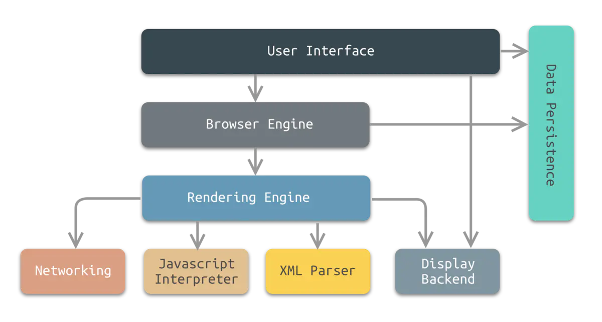

      分为八个部分，分别是：

      1. **用户界面（User Interface）**

         - 用户界面主要包括工具栏、地址栏、前进/后退按钮、书签菜单、可视化页面加载进度、智能下载处理、首选项、打印等。除了浏览器主窗口显示请求的页面之外，其他显示的部分都属于用户界面。

         - 用户界面还可以与桌面环境集成，以提供浏览器会话管理或与其他桌面应用程序的通信。

      2. **浏览器引擎（Browser Engine）**

         - 浏览器引擎是一个可嵌入的组件，其为渲染引擎提供高级接口。
         - 浏览器引擎可以加载一个给定的URI，并支持诸如：前进/后退/重新加载等浏览操作。
         - 浏览器引擎提供查看浏览会话的各个方面的挂钩，例如：当前页面加载进度、JavaScript alert。
         - 浏览器引擎还允许查询/修改渲染引擎设置。

      3. **渲染引擎（Rendering Engine）**

         - 渲染引擎为指定的URI生成可视化的表示。
         - 渲染引擎能够显示HTML和XML文档，可选择CSS样式，以及嵌入式内容（如图片）。
         - 渲染引擎能够准确计算页面布局，可使用“回流”算法逐步调整页面元素的位置。
         - 渲染引擎内部包含HTML解析器。
         - 常见的渲染引擎有Trident、Gecko、WebKit等。

      4. **网络（Networking）**

         - 网络系统实现HTTP和FTP等文件传输协议。 网络系统可以在不同的字符集之间进行转换，为文件解析MIME媒体类型。 网络系统可以实现最近检索资源的缓存功能。

      5. **JavaScript解释器（JavaScript Interpreter）**

         - JavaScript解释器能够解释并执行嵌入在网页中的JavaScript（又称ECMAScript）代码。 为了安全起见，浏览器引擎或渲染引擎可能会禁用某些JavaScript功能，如弹出窗口的打开。

      6. **XML解析器（XML Parser）**

         - XML解析器可以将XML文档解析成文档对象模型（Document Object Model，DOM）树。 XML解析器是浏览器架构中复用最多的子系统之一，几乎所有的浏览器实现都利用现有的XML解析器，而不是从头开始创建自己的XML解析器。

      7. **显示后端（Display Backend）**

         - 显示后端提供绘图和窗口原语，包括：用户界面控件集合、字体集合。

      8. **数据持久层（Data Persistence）**

         - 数据持久层将与浏览会话相关联的各种数据存储在硬盘上。 这些数据可能是诸如：书签、工具栏设置等这样的高级数据，也可能是诸如：Cookie，安全证书、缓存等这样的低级数据。

   2. 渲染引擎工作流程

      以HTML/JavaScript/CSS等文件作为输入，以可视化内容作为输出。

      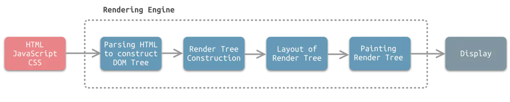

      1. **Parsing HTML to Construct DOM Tree**

         渲染引擎使用HTML解析器（调用XML解析器）解析HTML（XML）文档，将各个HTML（XML）元素逐个转化成DOM节点，从而生成**DOM树**。

         同时，渲染引擎使用CSS解析器解析外部CSS文件以及HTML（XML）元素中的样式规则。元素中带有视觉指令的样式规则将用于下一步创建另一个树结构：渲染树。

      2. **Render Tree construction**

         渲染引擎使用第1步CSS解析器解析得到的样式规则，将其附着到DOM树上，从而构成**渲染树**。

         渲染树包含多个带有视觉属性（如颜色和尺寸）的矩形。这些矩形的排列顺序就是它们将在屏幕上**显示的顺序**。

      3. **Layout of Render Tree**

         渲染树构建完毕之后，进入本阶段进行“布局”，也就是为每个节点分配一个应出现在屏幕上的**确切坐标**。

      4. **Painting Render Tree**

         渲染引擎将遍历渲染树，并调用**显示后端**将每个节点绘制出来。

      渲染引擎组成模块

      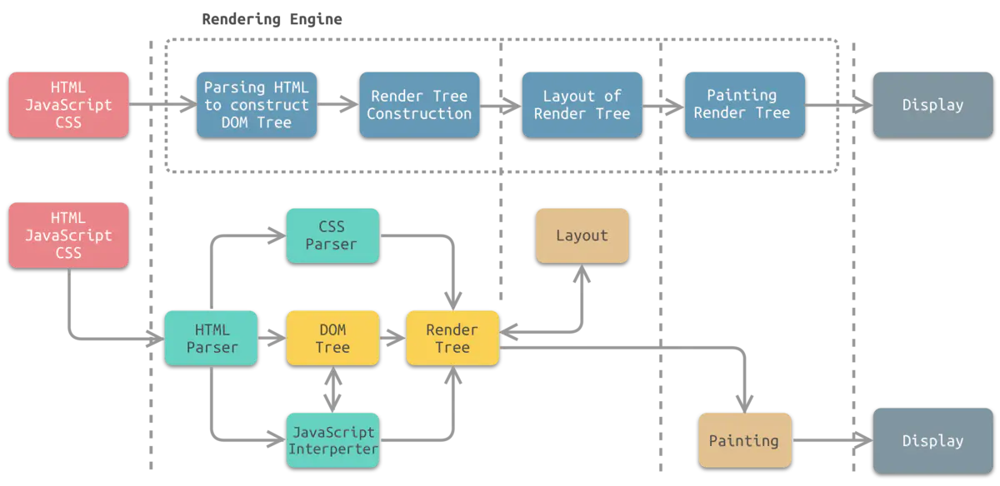

2. 重绘与回流

   > 当元素的样式发生变化时，浏览器需要触发更新，重新绘制元素。这个过程中，有两种类型的操作，即重绘与回流。

   - **重绘(repaint)**: 当元素样式的改变不影响布局时，浏览器将使用重绘对元素进行更新，此时由于只需要UI层面的重新像素绘制，因此 **损耗较少**。
   - **回流(reflow)**: 当元素的尺寸、结构或触发某些属性时，浏览器会重新渲染页面，称为回流。此时，浏览器需要重新经过计算，计算后还需要重新页面布局，因此是较重的操作。会触发回流的操作: 
     - 页面初次渲染
     - 浏览器窗口大小改变
     - 元素尺寸、位置、内容发生改变
     - 元素字体大小变化
     - 添加或者删除可见的 dom 元素
     - 激活 CSS 伪类（例如：:hover）
     - 查询某些属性或调用某些方法
       - clientWidth、clientHeight、clientTop、clientLeft
       - offsetWidth、offsetHeight、offsetTop、offsetLeft
       - scrollWidth、scrollHeight、scrollTop、scrollLeft
       - getComputedStyle()
       - getBoundingClientRect()
       - scrollTo()

   **回流必定触发重绘，重绘不一定触发回流。重绘的开销较小，回流的代价较高。**

   减少回流与重绘能够提升网页程序的执行效率。

### 2.浏览器特性

1. 跨标签页通信

   - 通过父页面`window.open()`和子页面`postMessage`
     - 异步下，通过 `window.open('about: blank')` 和 `tab.location.href = '*'` 

   - 设置同域下共享的`localStorage`与监听`window.onstorage`
     - 重复写入相同的值无法触发
     - 会受到浏览器隐身模式等的限制 

   - 设置共享`cookie`与不断轮询脏检查(`setInterval`)

   - 借助服务端或者中间层实现

2. Web Worker

   > 现代浏览器为`JavaScript`创造的 **多线程环境**。可以新建并将部分任务分配到`worker`线程并行运行，两个线程可 **独立运行，互不干扰**，可通过自带的 **消息机制** 相互通信。

   - **基本用法:**

     ```js
     // 创建 worker
     const worker = new Worker('work.js');
     
     // 向主进程推送消息
     worker.postMessage('Hello World');
     
     // 监听主进程来的消息
     worker.onmessage = function (event) {
       console.log('Received message ' + event.data);
     }
     ```

   - **限制:**

     - 同源限制；

     - 无法使用 `document` / `window` / `alert` / `confirm`；

     - 无法加载本地资源。

3. 浏览器存储

   - 短暂性的时候，我们只需要将数据存在内存中，只在运行时可用

   - 持久性存储，可以分为 浏览器端 与 服务器端
     - 浏览器: 
       - `cookie`: 通常用于存储用户身份，登录状态等
         - http 中自动携带， 体积上限为 4K， 可自行设置过期时间
       - `localStorage / sessionStorage`: 长久储存/窗口关闭删除， 体积限制为 4~5M
       - `indexDB` 
     - 服务器:
       - 分布式缓存 redis
       - 数据库 

## 四、TCP/IP

### 1.TCP/IP

1. TCP/IP模型

   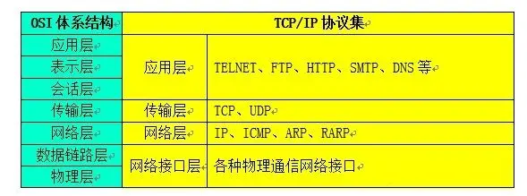

   - 应用层：应用层确定进程之间通信性质以满足用户需要。如万维网的HTTP协议，电子邮件的SMTP协议，文件传送的FTP协议等。

   - 传输层：传输层的任务就是**负责主机中的两个进程间的通信**。

     因特网的传输层可使用两种不同的协议：面向连接的传输控制协议TCP（Transmission Control Protocl）和无连接的用户数据报协议UDP（User Datagram Protocol）。

     **在分组交换网内的各个交换结点机都没有运输层。运输层智能存在于分组交换网外面的主机中**。传输层以上的各层就不再关心信息传输的问题了。因此，运输层就成为计算机网络体系结构中非常重要的一层。

   - 网络层：又叫IP层，网络层负责为分组交换网上的不同主机提供通信。在发送数据时，**网络层将传输层产生的报文段或用户数据封装成分组或包进行传送**。

   - 数据链路层：在发送数据时，数据链路层的任务是将在网络层传下来的IP数据报**组装成帧**，在两个相邻结点间的链路上传送以帧为单位的数据。

   - 物理层：物理层的任务就是**透明地传送比特流**。如一些物理媒介：双绞线、光缆等。

2. TCP协议

   > 传输控制协议（TCP，Transmission Control Protocol）是一种**面向连接的、可靠的、基于字节流的**传输层通信协议。

   工作方式：

   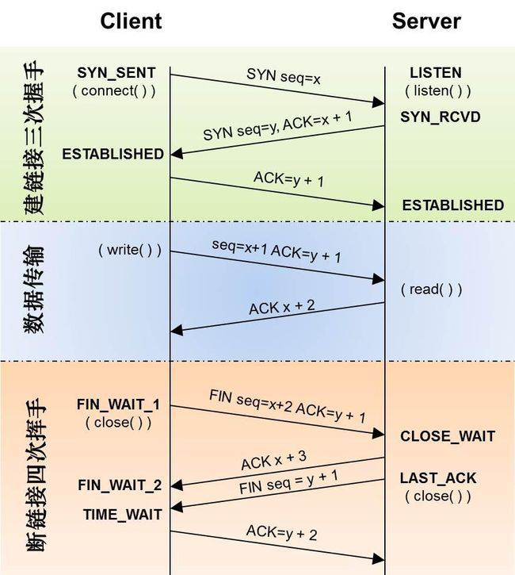

### 2.HTTP/HTTPS

1. HTTP

   - 请求报文首部

     1. 请求行：`[方法] [URI] [协议版本]`， 如：`GET /index.html HTTP/1.1`
     2. 请求首部字段
     3. 通用首部字段
     4. 实体首部字段
     5. 其他

     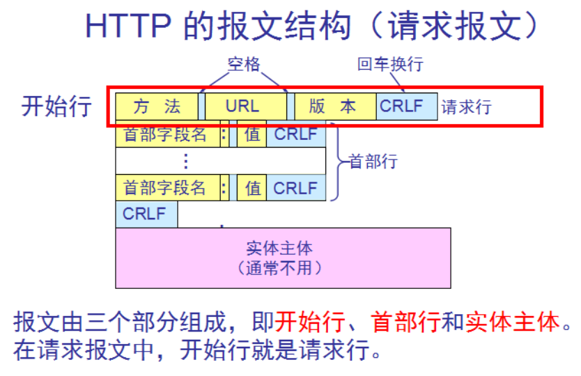

   - 响应报文首部

     1. 状态行：`[协议版本] [状态码] [状态码的原因短语]`，如：`HTTP/1.1 200 OK`
     2. 响应首部字段
     3. 通用首部字段
     4. 实体首部字段
     5. 其他

     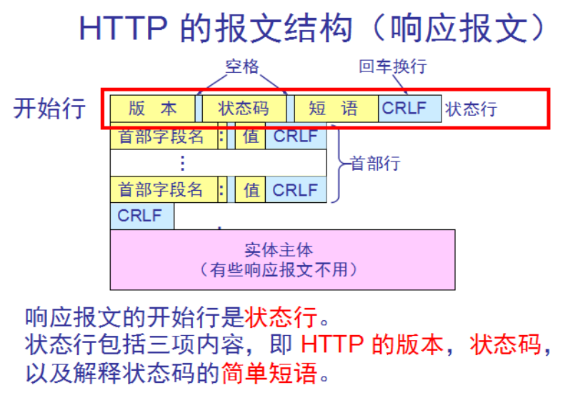
     
   - 响应状态码

     - 1XX 信息性状态码

       接收的请求正在处理。

     - 2XX 成功状态码

       请求正常处理完毕。

     - 3XX 重定向

       浏览器需要执行某些特殊的处理以正确处理请求。

     - 4XX 客户端错误

       表明客户端是发生错误的所在。

     - 5XX 服务器错误

       表明服务器本身发生错误。

2. HTTPS

   HTTP的缺点：

   - 通信使用明文，内容可能会被窃听
   - 不验证通信方的身份，因此可能遭遇伪装
   - 无法证明报文的完整性，所以可能已遭篡改

   因此诞生了HTTPS，HTTP + 加密 + 认证 + 完整性保护 = HTTPS（HTTP Secure）。

   HTTPS和HTTP的差异在于，HTTP的通信接口部分用SSL（Secure Socket Layer）和TLS（Transport Layer Securit）替代。

   针对HTTP的缺点，HTTPS的对应解决方式为：

   - 采用混合加密方式

     采用公开密钥方式和共享密钥方式结合的方式，在保证通信安全的情况下，也能最大限度的保证处理速度。

     - 公开密钥加密：

       发送密钥的一方使用对方的公开密钥进行加密处理，对方收到加密的信息后，再使用自己的私有密钥进行解密。

     - 共享密钥加密：

       两方使用同一密钥进行加密和解密。

   - 证明公开密钥正确性的证书

     使用由数字证书认证机构（CA）和其相关机关颁发的公开密钥证书。数字证书认证机构是客户端和服务器都可信赖的第三方机构。

   - MAC报文摘要

     Message Authentication Code，MAC是指消息认证码（带密钥的[Hash函数](https://baike.baidu.com/item/Hash函数/10555888)），可用于数据源发认证和完整性校验。

3. Websocket

   WebSocket是一种在单个[TCP](https://baike.baidu.com/item/TCP)连接上进行[全双工](https://baike.baidu.com/item/全双工)通信的协议。

### 3.前端网络开发相关

1. 跨域及其解决方法

   > 跨域，一般指xhr网络请求与浏览器的访问地址之间在网络协议、域名和端口中有任意一个不一致造成的浏览器同源策略阻止。

   - 解决方法

     1. jsonp：原理是利用scrip标签访问链接不会跨域的特性，通过script标签访问特定的数据，并将服务器返回的数据通过回调函数异步的使用；

     2. 浏览器关闭同源策略，chrome：

        ```
        "C:\Program Files\Google\Chrome\Application\chrome.exe" --allow-file-access-from-files --user-data-dir="C:\Users\bst\MyChromeUserData" --disable-web-security
        ```

     3. 同源代理转发，通过另一个与浏览器同源的代理服务器，转发数据；

     4. 服务端允许CORS，将返回数据配置为不做同源限制。

### 4.网络安全相关

1. 跨站脚本攻击（XSS）

   - 概念

     XSS：Cross Site Scripting，跨站脚本攻击。指恶意攻击者往web页面中注入XSS脚本代码，当用户打开该页面时，注入其中的脚本代码就会执行，从而达到恶意攻击用户的目的。

   - 分类

     1. 反射型XSS，又称为非持久型XSS：攻击相较于访问者而言只有一次。

     2. 储存型XSS，又称持久型XSS：恶意脚本代码被存储在了服务器/数据库中，每次访问这个资源的用户都会被攻击。

   - 危害示例

     1. 劫持访问

     2. cookies盗用

     3. 配合csrf攻击完成恶意请求

   - 防范手段

     1. 过滤标签，诸如<script>  <a>等标签进行过滤

     2. 在编码时，对一些常见的符号（有其他意义的代码符号），进行编码转化，如 < >等

     3. 限制文本的输入长度，因为一般的攻击代码会很长

   参考自：https://zhuanlan.zhihu.com/p/26177815

2. 跨站点伪造请求

   - 定义

     CSRF(Cross-site request forgery)：跨站伪造请求，是一种挟制用户在已登录的web应用上执行非本意的操作的攻击方法。

     与XSS的区别在于，XSS利用的是用户对网页服务器的信任；而CSRF利用的是，网页服务器对用户浏览器的信任。

     比如，在获取到用户的认证密钥后，以此密钥去向服务器发送恶意请求。

   - 防范手段

     1. 涉及敏感操作的请求改为POST请求
     2. 用户验证码
     3. 请求来源限制，验证http referer字段
     4. 额外验证机制，token使用


   参考自https://blog.csdn.net/weixin_40482816/article/details/114301717

## 五、Vue

### 1.生命周期

- `_init_`  
  - `initLifecycle/Event`，往`vm`上挂载各种属性
  - `callHook: beforeCreated`: 实例刚创建
  - `initInjection/initState`: 初始化注入和 data 响应性
  - `created`: 创建完成，属性已经绑定， 但还未生成真实`dom`
  - 进行元素的挂载： `$el / vm.$mount()`
  - 是否有`template`: 解析成`render function`
    - `*.vue`文件: `vue-loader`会将`<template>`编译成`render function`
  - `beforeMount`: 模板编译/挂载之前
  - 执行`render function`，生成真实的`dom`，并替换到`dom tree`中
  - `mounted`: 组件已挂载

- `update`:
  - 执行`diff`算法，比对改变是否需要触发UI更新
  - `flushScheduleQueue`
    - `watcher.before`: 触发`beforeUpdate`钩子		- `watcher.run()`: 执行`watcher`中的 `notify`，通知所有依赖项更新UI
  - 触发`updated`钩子: 组件已更新

- `actived / deactivated(keep-alive)`: 不销毁，缓存，组件激活与失活

- `destroy`:
  - `beforeDestroy`: 销毁开始
  - 销毁自身且递归销毁子组件以及事件监听
    - `remove()`: 删除节点
    - `watcher.teardown()`: 清空依赖
    - `vm.$off()`: 解绑监听
  - `destroyed`: 完成后触发钩子

```js
new Vue({})

// 初始化Vue实例
function _init() {
	 // 挂载属性
    initLifeCycle(vm) 
    // 初始化事件系统，钩子函数等
    initEvent(vm) 
    // 编译slot、vnode
    initRender(vm) 
    // 触发钩子
    callHook(vm, 'beforeCreate')
    // 添加inject功能
    initInjection(vm)
    // 完成数据响应性 props/data/watch/computed/methods
    initState(vm)
    // 添加 provide 功能
    initProvide(vm)
    // 触发钩子
    callHook(vm, 'created')
		
	 // 挂载节点
    if (vm.$options.el) {
        vm.$mount(vm.$options.el)
    }
}

// 挂载节点实现
function mountComponent(vm) {
	 // 获取 render function
    if (!this.options.render) {
        // template to render
        // Vue.compile = compileToFunctions
        let { render } = compileToFunctions() 
        this.options.render = render
    }
    // 触发钩子
    callHook('beforeMounte')
    // 初始化观察者
    // render 渲染 vdom， 
    vdom = vm.render()
    // update: 根据 diff 出的 patchs 挂载成真实的 dom 
    vm._update(vdom)
    // 触发钩子  
    callHook(vm, 'mounted')
}

// 更新节点实现
funtion queueWatcher(watcher) {
	nextTick(flushScheduleQueue)
}

// 清空队列
function flushScheduleQueue() {
	 // 遍历队列中所有修改
    for(){
	    // beforeUpdate
        watcher.before()
         
        // 依赖局部更新节点
        watcher.update() 
        callHook('updated')
    }
}

// 销毁实例实现
Vue.prototype.$destory = function() {
	 // 触发钩子
    callHook(vm, 'beforeDestory')
    // 自身及子节点
    remove() 
    // 删除依赖
    watcher.teardown() 
    // 删除监听
    vm.$off() 
    // 触发钩子
    callHook(vm, 'destoryed')
}
```

### 2.响应式原理

### 3.虚拟Dom原理

### 4.vue-router

### 5.vuex

### 6.vue3

## 六、后端技术

### 1.通用技术

- [ ] 前后端分离技术、SSR
- [ ] nginx
- [ ] docker
- [ ] 数据库

### 2.nodejs相关

- [ ] 原生api的使用
- [ ] express、koa框架的使用

## 数据结构和算法

### 1.常用数据结构

- [ ] 树
- [ ] 图
- [ ] 堆

### 2.算法基础

- [ ] 时间/空间复杂度

### 2.排序算法

- [ ] 排序算法

### 3.常用算法及思想

- [ ] 回溯法
- [ ] 动态规划
- [ ] 贪心算法
- [ ] 分治算法
- [ ] 分支限界法？

## 前端性能优化

### 1.编码优化

### 2.页面优化

### 3.网络加载优化

## Webpack

### 1.原理

- [ ] 原理

### 2.特性

- [ ] loader
- [ ] plugin

### 3.使用方法

- [ ] 编译优化

## 设计模式

## React

## Hybrid

