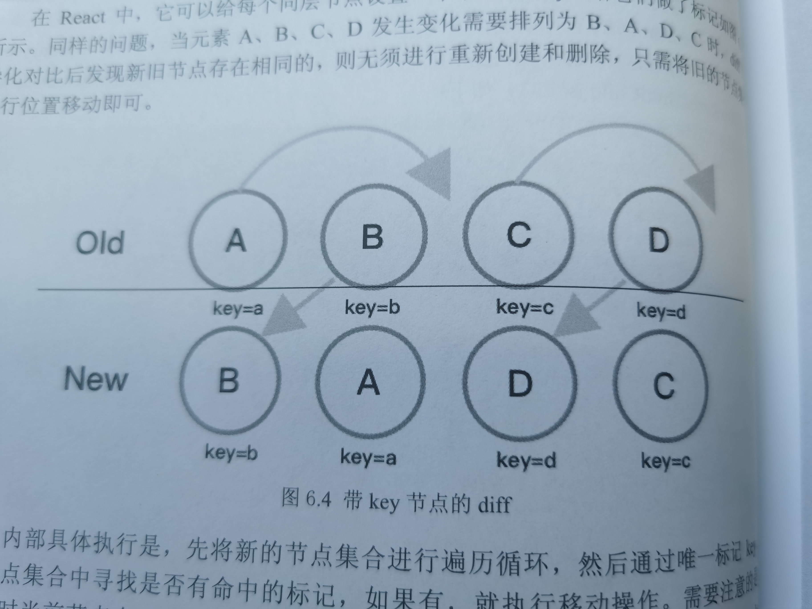

# React diff算法

普通算法：将每个节点一一对比，循环遍历所有子节点，然后再判断子节点的更新状态，时间复杂度为O(n^3)。

而React diff算法的时间复杂度仅为O(n)。

基于两个假设：

1. 两个不同类型的元素将产生两个不同的树；
2. 同一级的一组子节点，可以埋入一个key属性加以区分；

采用了三个策略：

1. DOM节点跨层级操作很少，可以忽略，所以依照层级比对即可；
2. 拥有相同类的两个组件会产生相似的树形结构，拥有不同类的两个组件会产生不同的树形结构；
3. 同一层级一组子节点通过唯一id来区分；

分别对应了三种diff算法：

1. Tree Diff

   同层求异，将新旧两棵DOM树依照层级去比较，有差异的部分立即进行标记（直接销毁），且差异部分的子节点不会在进行比较。

2. Component Diff

   对比组件的“树”结构。同类型组件，需要递归遍历；不同类型组件，直接替换。发生变化的组件被称为dirty component。

   

3. Element Diff

   在遇到组件类型相同的情况下，会进行内部元素对比，之后会进行插入、移动、删除的操作。

   具体逻辑：用唯一id标记列表，将新组件的所有节点集合并进行遍历，然后去寻找是否能在老组件节点集合中命中对应的id，保留这些命中的节点，将未命中的节点直接标记删除。进行位置排序，之后再将新组件中新增的节点依次插入指定位置。

   

整体的结构图：

