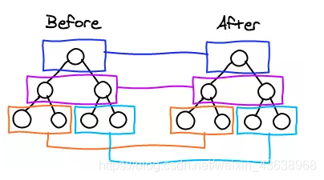
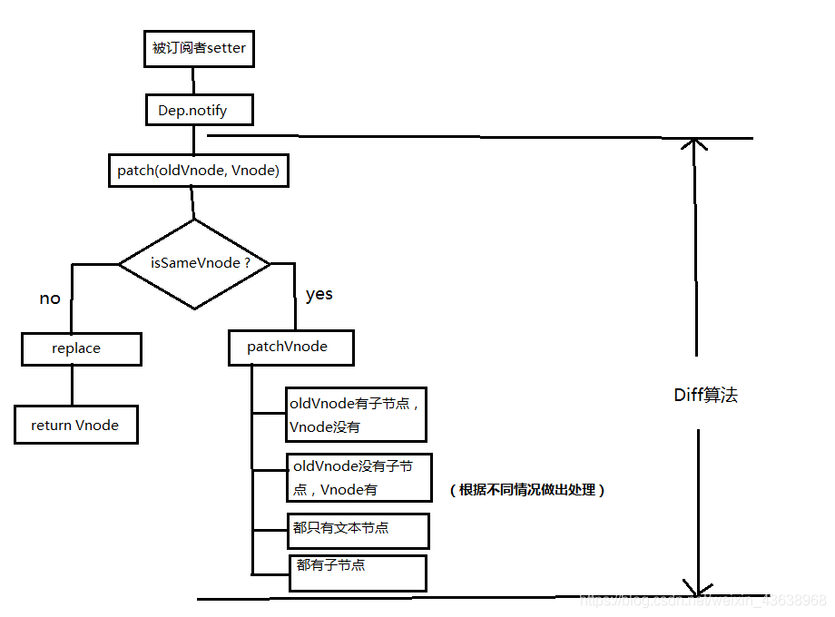

# Vue diff算法

diff算法就是将新老虚拟节点进行比对，返回一个差异patch对象，最后通过patch对象去更新真实的DOM。

Vue diff算法有两个特点：

1. 同层比较；
2. 循环从两边到中间；

如图：

diff算法策略：深度优先，同层比较。

1. 比较只会在同层级进行, 不会跨层级比较

   

2. 比较的过程中，循环从两边向中间收拢

   

下面举个vue通过diff算法更新的例子：
新旧VNode节点如下图所示：

第一次循环后，发现旧节点D与新节点D相同，直接复用旧节点D作为diff后的第一个真实节点，同时旧节点endIndex移动到C，新节点的 startIndex 移动到了 C

第二次循环后，同样是旧节点的末尾和新节点的开头(都是 C)相同，同理，diff 后创建了 C 的真实节点插入到第一次创建的 B 节点后面。同时旧节点的 endIndex 移动到了 B，新节点的 startIndex 移动到了 E

第三次循环中，发现E没有找到，这时候只能直接创建新的真实节点 E，插入到第二次创建的 C 节点之后。同时新节点的 startIndex 移动到了 A。旧节点的 startIndex 和 endIndex 都保持不动

第四次循环中，发现了新旧节点的开头(都是 A)相同，于是 diff 后创建了 A 的真实节点，插入到前一次创建的 E 节点后面。同时旧节点的 startIndex 移动到了 B，新节点的startIndex 移动到了 B

第五次循环中，情形同第四次循环一样，因此 diff 后创建了 B 真实节点 插入到前一次创建的 A 节点后面。同时旧节点的 startIndex移动到了 C，新节点的 startIndex 移动到了 F

新节点的 startIndex 已经大于 endIndex 了，需要创建 newStartIdx 和 newEndIdx 之间的所有节点，也就是节点F，直接创建 F 节点对应的真实节点放到 B 节点后面

