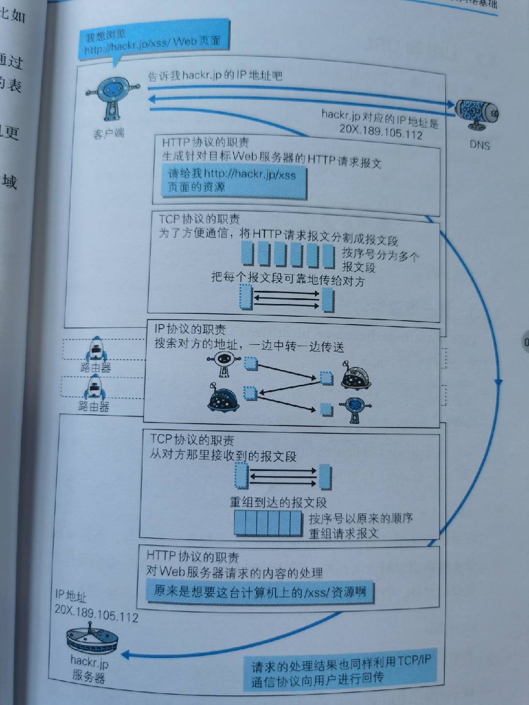

# 计算机网络

## 概述

> 计算机网络是指将[地理](https://baike.baidu.com/item/地理)位置不同的具有独立功能的多台[计算机](https://baike.baidu.com/item/计算机/140338)及其外部设备，通过通信线路连接起来，在[网络操作系统](https://baike.baidu.com/item/网络操作系统/3997)，[网络管理软件](https://baike.baidu.com/item/网络管理软件/6579078)及[网络通信协议](https://baike.baidu.com/item/网络通信协议/4438611)的管理和协调下，实现[资源共享](https://baike.baidu.com/item/资源共享/233480)和信息传递的计算机系统。

### 计算机网络的分类

1. 电路交换

   电路交换（CS:circuit switching）是通信网中最早出现的一种交换方式，也是应用最普遍的一种交换方式，主要应用于电话通信网中，完成电话交换，已有100多年的历史。

   电话通信的过程是：首先摘机，听到拨号音后拨号，交换机找寻被叫，向被叫振铃同时向主叫送回铃音，此时表明在电话网的主被叫之间已经建立起双向的话音传送通路；当被叫摘机应答，即可进入通话阶段；在通话过程中，任何一方挂机，交换机会拆除已建立的通话通路，并向另一方送忙音提示挂机，从而结束通话。

   从电话通信过程的描述可以看出，电话通信分为三个阶段：**呼叫建立、通话、呼叫拆除**。电话通信的过程，即电路交换的过程，因此，相应的电路交换的基本过程可分为连接建立、信息传送和连接拆除三个阶段。

   

2. 报文交换

   **报文交换**（英文：message switching），又称**存储转发交换**，是数据交换的三种方式之一，**报文整个地发送**，一次一跳。报文交换是[分组交换](https://baike.baidu.com/item/分组交换)的前身，是由[莱昂纳多·克莱洛克](https://baike.baidu.com/item/莱昂纳多·克莱洛克)于1961年提出的。

   报文交换的主要特点是：存储接收到的报文，判断其目标地址以选择路由，最后，在[下一跳](https://baike.baidu.com/item/下一跳)路由空闲时，将数据转发给下一跳路由。报文交换系统现今都由分组交换或电路交换网络所承载。

   

3. 分组交换

   在通信过程中，通信双方以分组为单位、使用存储-转发机制实现数据交互的通信方式，被称为分组交换（PS:packet switching）。

   分组交换也称为包交换，它**将用户通信的数据划分成多个更小的等长数据段**，在每个数据段的前面**加上必要的控制信息作为数据段的首部**，每个带有首部的数据段就构成了一个分组。首部指明了该分组发送的地址，当交换机收到分组之后，将根据首部中的地址信息将分组转发到目的地，这个过程就是分组交换。能够进行分组交换的通信网被称为分组交换网。

   分组交换的本质就是存储转发，它将所接受的分组暂时存储下来，在目的方向路由上排队，当它可以发送信息时，再将信息发送到相应的路由上，完成转发。其存储转发的过程就是分组交换的过程。

   分组交换的思想来源于报文交换，报文交换也称为存储转发交换，它们交换过程的本质都是存储转发，所不同的是分组交换的最小信息单位是分组，而报文交换则是一个个报文。由于以较小的分组为单位进行传输和交换，所以分组交换比报文交换快。报文交换主要应用于公用电报网中。

   

4. 混合交换

   在一个数据网中同时采用电路交换和分组交换。

   ### 计算机网络的主要性能指标

   #### 带宽

   带宽（bandwidth），数字信道所能传送的“最高数据率”，通俗的讲就是网速。

   带宽的单位为比特每秒 `b/s`。

   #### 时延

   时延（delay）是指一个报文或分组从一个网络的一端传送到另一端所需的时间，通俗的讲就是网络延时（如ping值）。

   时延由三部分组成

   1. 发送时延：节点在发送数据时使数据块从结点进入到传输媒体所需要的时间。
   2. 传播时延：电磁波在信道中需要传播一定的距离而花费的时间。
   3. 处理时延：数据在交换结点为存储转发而进行一些必要的处理所花费的时间。

   `总时延 = 传播时延 + 发送时延 + 处理时延` 

### 计算机网络的体系结构

先来张图。

这种体系结构又被称为TCP/IP模型。

OSI体系结构（开放系统互连基本参考模型），定义了计算机网络的体系结构，但其七层协议体系既复杂又不实用。因此TCP/IP模型会更加通用。

1. 应用层：应用层确定进程之间通信性质以满足用户需要。如万维网的HTTP协议，电子邮件的SMTP协议，文件传送的FTP协议等。

2. 传输层：传输层的任务就是**负责主机中的两个进程间的通信**。

   因特网的传输层可使用两种不同的协议：面向连接的传输控制协议TCP（Transmission Control Protocl）和无连接的用户数据报协议UDP（User Datagram Protocol）。

   **在分组交换网内的各个交换结点机都没有运输层。运输层智能存在于分组交换网外面的主机中**。传输层以上的各层就不再关心信息传输的问题了。因此，运输层就成为计算机网络体系结构中非常重要的一层。

3. 网络层：又叫IP层，网络层负责为分组交换网上的不同主机提供通信。在发送数据时，**网络层将传输层产生的报文段或用户数据封装成分组或包进行传送**。

4. 数据链路层：在发送数据时，数据链路层的任务是将在网络层传下来的IP数据报**组装成帧**，在两个相邻结点间的链路上传送以帧为单位的数据。

5. 物理层：物理层的任务就是**透明地传送比特流**。如一些物理媒介：双绞线、光缆等。

   > ”透明“表示：某一个实际存在的事物看起来却好像不存在一样。
   >
   > ”透明底传送比特流“表示经实际电路传送后的比特流没有发生变化。

在因特网所使用的各种协议中，最重要的和最著名的就是TCP和IP两个协议。现在人们经常提到的TCP/IP并不一定是指TCP和IP这两个具体的协议，而往往是表示因特网所使用的体系结构或是整个的TCP/IP协议族（Protocol Suite）。

## 物理层

物理层考虑的时怎样才能**在连接各种计算机的传输媒体上传输数据比特流**，而不是指连接计算机的具体的物理设备或具体的传输媒体。

由于现有计算机网络中的物理设备和传输媒体的种类非常繁多，因此物理层的作用正是要尽可能地屏蔽掉这些差异，使数据链路层完全感觉不到这些差异。

### 物理层标准举例

- EIA-232-E
- RS-449
- 802.11？

## 数据链路层

负责在两个相邻结点之间的线路上无差错地传输以[帧](https://baike.baidu.com/item/帧/23750184)为单位的数据，即将一条有可能出差错的实际链路转变成让网络层向下看去好像是一条不出差错的[链路](https://baike.baidu.com/item/链路/9410314)。数据链路层将数据分解成帧，然后按顺序传输帧，每一帧包括数据和必要的控制信息（包括[同步信息](https://baike.baidu.com/item/同步信息/5925963)、地址信息、[差错控制](https://baike.baidu.com/item/差错控制/1614020)信息和[流量控制](https://baike.baidu.com/item/流量控制/3441910)信息等）。

 数据链路层负责将比特流划分为数据帧从一个节点传输到临近的另一个节点,这些节点是通过MAC来唯一标识的(MAC,物理地址，一个主机会有一个MAC地址)。

### 数据链路层协议举例

- SDLC
- HDLC

## 网络层

为网络上的不同主机提供通信。它通过路由选择算法，为分组通过通信子网选择最适当的路径，以实现网络的[互连](https://baike.baidu.com/item/互连/5922473)功能。具体地说，数据链路层的数据在这一层被转换为数据包，然后通过路径选择、分段组合、[流量控制](https://baike.baidu.com/item/流量控制/3441910)、[拥塞控制](https://baike.baidu.com/item/拥塞控制/732651)等将信息从一台网络设备传送到另一台网络设备。网络层负责在网络中传送的数据单元是分组或包。

### 网络层协议举例

#### IP协议

IP协议（Internet Protocol）是TCP/IP协议的核心，所有的TCP，UDP，IMCP，IGMP的数据都以IP数据格式传输。要注意的是，IP不是可靠的协议，这是说，IP协议没有提供一种数据未传达以后的处理机制，这被认为是上层协议：TCP或UDP要做的事情。 

##### IP地址

IP地址是[IP协议](https://baike.baidu.com/item/IP协议/131947)提供的一种统一的[地址格式](https://baike.baidu.com/item/地址格式/53569124)，它为互联网上的每一个网络和每一台[主机](https://baike.baidu.com/item/主机/455151)分配一个[逻辑地址](https://baike.baidu.com/item/逻辑地址/3283849)，以此来屏蔽[物理地址](https://baike.baidu.com/item/物理地址/2901583)的差异。

- IPv4：10.28.8.81
- IPv6：ABCD:EF01:2345:6789:ABCD:EF01:2345:6789

##### IPv4首部

- **版本**：表示 IP 协议的版本。
- **首部长度：**首部的长度，单位是 4 字节。
- **区分服务：**暂时无意义。
- **总长度：**首部和数据之和的长度，单位为字节，当数据报的总长度超过数据链路层的最大传送单元时就必须进行分片处理。将一个 IP 数据报分成多个分片，每个分片都具有 IP 首部。
- **标识：**对分片进行标识，同一个数据报的分片具有同样的标识。
- **标志：**占 3 位。最低位记为 MF(More Fragment)，MF = 1 表示后面“还有分片”，MF = 0 表示这是多个数据报片中的最后一个；中间一位记为 DF(Don't Fragment)，只有当 DF = 0 时才允许分片。
- **片偏移：**表示该分片在原分组中的相对位置，片偏移以 8 个字节为偏移单位。
- **生存时间：**TTL，表示该数据报在网络中可以被转发的次数，每经过一次转发，这个值减 1。
- **首部校验和：**这个字段只检验数据报的首部，不检验数据部分。
- **源地址**
- **目的地址**
- **可变部分：**可变部分中包括用于增加 IP 数据报功能的选项，这些选项一个一个拼起来，中间不需要分隔符，最后用 0 填充为 4 字节的整数倍。

##### IPv6首部

 

- **版本：**协议的版本，对于 IPv6 是 6.
- **流标号**：“流”指互联网络上从特定源点到特定终点的一系列数据报，所有属于同一个流的数据报都具有同样的流标号。
- **有效载荷长度：**表示 IPv6 数据报除基本首部以外的字节数。
- **下一个首部：**当没有扩展首部时，下一个首部字段指出基本首部后面的数据应该移交给哪个高层协议。当出现扩展首部时，下一个首部字段的值表示后面第一个扩展首部的类型。
- 数据报图中经过的路由器不处理扩展首部。
- IPv6 采用冒号十六进制记法，如 68E6:8C64:FFFF:FFFF:0:1180:960A:FFFF，冒号十六进制记法允许零压缩，即一连串连续的零可以为一对冒号所取代，任一地址中只能够使用一次零压缩。

#### ARP协议

ARP（Address Resolution Protocol），地址解析协议。

[主机](https://baike.baidu.com/item/主机/455151)发送信息时将包含目标IP地址的ARP请求广播到局域网络上的所有主机，并接收返回消息，以此确定目标的物理地址（MAC）；收到返回消息后将该IP地址和物理地址存入本机ARP缓存中并保留一定时间，下次请求时直接查询ARP缓存以节约资源。

## 传输层

负责主机中的两个进程间的通信。

### 传输层协议举例

#### TCP协议

传输控制协议（TCP，Transmission Control Protocol）是一种**面向连接的、可靠的、基于字节流的**传输层通信协议。

##### 主要功能

当应用层向TCP层发送用于网间传输的、用8位字节表示的[数据流](https://baike.baidu.com/item/数据流)，TCP则把数据流分割成适当长度的报文段，最大传输段大小（[MSS](https://baike.baidu.com/item/MSS/3567770)）通常受该计算机连接的网络的数据链路层的最大传送单元（[MTU](https://baike.baidu.com/item/MTU)）限制。之后TCP把数据包传给IP层，由它来通过网络将包传送给接收端实体的TCP层。 

TCP为了保证报文传输的可靠，就给每个包一个序号，同时序号也保证了传送到接收端实体的包的按序接收。然后接收端实体对已成功收到的字节发回一个相应的确认（ACK）；如果发送端实体在合理的往返时延（RTT）内未收到确认，那么对应的数据（假设丢失了）将会被重传。

- 在数据正确性与合法性上，TCP用一个校验和函数来检验数据是否有错误，在发送和接收时都要计算校验和；同时可以使用md5认证对数据进行加密。
- 在保证可靠性上，采用超时重传和捎带确认机制。
- 在流量控制上，采用滑动窗口协议，协议中规定，对于窗口内未经确认的分组需要重传。

在拥塞控制上，采用广受好评的TCP拥塞控制算法（也称AIMD算法）。该算法主要包括四个主要部分：

（1）慢启动

每当建立一个TCP连接时或一个TCP连接发生超时重传后，该连接便进入慢启动阶段。进入慢启动后，TCP实体将拥塞窗口的大小初始化为一个报文段，即：cwnd=1。此后，每收到一个报文段的确认（ACK），cwnd值加1，即拥塞窗口按指数增加。当cwnd值超过慢启动阐值（ssthresh）或发生报文段丢失重传时，慢启动阶段结束。前者进入拥塞避免阶段，后者重新进入慢启动阶段。

（2）拥塞避免

在慢启阶段，当cwnd值超过慢启动阐值（ssthresh）后，慢启动过程结束，TCP连接进入拥塞避免阶段。在拥塞避免阶段，每一次发送的cwnd个报文段被完全确认后，才将cwnd值加1。在此阶段，cwnd值线性增加。

（3）快速重传

快速重传是对超时重传的改进。当源端收到对同一个报文的三个重复确认时，就确定一个报文段已经丢失，因此立刻重传丢失的报文段，而不必等到重传定时器（RTO）超时。以此减少不必要的等待时间。

（4）快速恢复

快速恢复是对丢失恢复机制的改进。在快速重传之后，不经过慢启动过程而直接进入拥塞避免阶段。每当快速重传后，置ssthresh=cwnd/2、ewnd=ssthresh+3。此后，每收到一个重复确认，将cwnd值加1，直至收到对丢失报文段和其后若干报文段的累积确认后，置cwnd=ssthresh，进入拥塞避免阶段。

##### TCP首部

 

- **序号** **：**用于对字节流进行编号，例如序号为 301，表示第一个字节的编号为 301，如果携带的数据长度为 100 字节，那么下一个报文段的序号应为 401。
- **确认号** **：**期望收到的下一个报文段的序号。例如 B 正确收到 A 发送来的一个报文段，序号为 501，携带的数据长度为 200 字节，因此 B 期望下一个报文段的序号为 701，B 发送给 A的确认报文段中确认号就为 701。
- **数据偏移** ：指的是数据部分距离报文段起始处的偏移量，实际上指的是首部的长度。
- **确认 ACK** ：当 ACK=1 时确认号字段有效，否则无效。TCP 规定，在连接建立后所有传送的报文段都必须把 ACK 置 1。
- **同步 SYN** **：**在连接建立时用来同步序号。当 SYN=1，ACK=0 时表示这是一个连接请求报文段。若对方同意建立连接，则响应报文中 SYN=1，ACK=1。
- **终止 FIN** **：**用来释放一个连接，当 FIN=1 时，表示此报文段的发送方的数据已发送完毕，并要求释放运输连接。
- **窗口** **：**窗口值作为接收方让发送方设置其发送窗口的依据。之所以要有这个限制，是因为接收方的数据缓存空间是有限的。

**TCP连接:SYN ACK RST UTG PSH FIN**

**SYN：同步标志**

同步序列编号(Synchronize Sequence Numbers)栏有效。该标志仅在三次握手建立TCP连接时有效。它提示TCP连接的服务端检查序列编号，该序列编号为TCP连接初始端(一般是客户端)的初始序列编号。

**ACK：确认标志**

确认编号(Acknowledgement Number)栏有效。大多数情况下该标志位是置位的。TCP报头内的确认编号栏内包含的确认编号(w+1，Figure-1)为下一个预期的序列编号，同时提示远端系统已经成功接收所有数据。

**RST：复位标志**

复位标志有效。用于复位相应的TCP连接。

**URG：紧急标志**

紧急(The urgent pointer) 标志有效。紧急标志置位，

**PSH：推标志**

该标志置位时，接收端不将该数据进行队列处理，而是尽可能快将数据转由应用处理。在处理 telnet 或 rlogin 等交互模式的连接时，该标志总是置位的。

**FIN：结束标志**

带有该标志置位的数据包用来结束一个TCP回话，但对应端口仍处于开放状态，准备接收后续数据。

##### 工作方式

- 建立连接（三次握手）

  为什么要三次握手？：

  为了防止已失效的连接请求报文段突然又传送到了服务端，因而产生错误。

  具体例子：“已失效的连接请求报文段”的产生在这样一种情况下：client发出的第一个连接请求报文段并没有丢失，而是在某个网络结点长时间的滞留了，以致延误到连接释放以后的某个时间才到达server。本来这是一个早已失效的报文段。但server收到此失效的连接请求报文段后，就误认为是client再次发出的一个新的连接请求。于是就向client发出确认报文段，同意建立连接。假设不采用“三次握手”，那么只要server发出确认，新的连接就建立了。由于现在client并没有发出建立连接的请求，因此不会理睬server的确认，也不会向server发送数据。但server却以为新的运输连接已经建立，并一直等待client发来数据。这样，server的很多资源就白白浪费掉了。采用“三次握手”的办法可以防止上述现象发生。例如刚才那种情况，client不会向server的确认发出确认。server由于收不到确认，就知道client并没有要求建立连接。” 

  握手步骤：

  1. 客户端发送SYN（SEQ=x）报文给服务器端，进入SYN_SEND状态。

  2. 服务器端收到SYN报文，回应一个SYN （SEQ=y）ACK（ACK=x+1）报文，进入[SYN_RECV](https://baike.baidu.com/item/SYN_RECV)状态。

  3. 客户端收到服务器端的SYN报文，回应一个ACK（ACK=y+1）报文，进入Established状态。

- 连接终止（四次挥手）

  为什么要四次挥手？：

  TCP协议是一种面向连接的、可靠的、基于字节流的运输层通信协议。TCP是全双工模式，这就意味着，当主机1发出FIN报文段时，只是表示主机1已经没有数据要发送了，主机1告诉主机2，它的数据已经全部发送完毕了；但是，这个时候主机1还是可以接受来自主机2的数据；当主机2返回ACK报文段时，表示它已经知道主机1没有数据发送了，但是主机2还是可以发送数据到主机1的；当主机2也发送了FIN报文段时，这个时候就表示主机2也没有数据要发送了，就会告诉主机1，我也没有数据要发送了，之后彼此就会愉快的中断这次TCP连接。

  挥手步骤：
  
  1. 某个应用进程首先调用close，称该端执行“主动关闭”（active close）。该端的TCP于是发送一个FIN分节，表示数据发送完毕。
  
  2. 接收到这个FIN的对端执行 “被动关闭”（passive close），这个FIN由TCP确认。
  
     注意：FIN的接收也作为一个文件结束符（end-of-file）传递给接收端应用进程，放在已排队等候该应用进程接收的任何其他数据之后，因为，FIN的接收意味着接收端应用进程在相应连接上再无额外数据可接收。
  
  3. 一段时间后，接收到这个文件结束符的应用进程将调用close关闭它的套接字。这导致它的TCP也发送一个FIN。
  4.  接收这个最终FIN的原发送端TCP（即执行主动关闭的那一端）确认这个FIN。

##### TCP流量控制

如果发送方把数据发送得过快，接收方可能会来不及接收，这就会造成数据的丢失。所谓流量控制就是让发送方的发送速率不要太快，要让接收方来得及接收。

利用滑动窗口机制可以很方便地在TCP连接上实现对发送方的流量控制。

设A向B发送数据。在连接建立时，B告诉了A：“我的接收窗口是 rwnd = 400 ”(这里的 rwnd 表示 receiver window) 。因此，发送方的发送窗口不能超过接收方给出的接收窗口的数值。请注意，TCP的窗口单位是字节，不是报文段。假设每一个报文段为100字节长，而数据报文段序号的初始值设为1。大写ACK表示首部中的确认位ACK，小写ack表示确认字段的值ack。

  

从图中可以看出，B进行了三次流量控制。第一次把窗口减少到 rwnd = 300 ，第二次又减到了 rwnd = 100 ，最后减到 rwnd = 0 ，即不允许发送方再发送数据了。这种使发送方暂停发送的状态将持续到主机B重新发出一个新的窗口值为止。B向A发送的三个报文段都设置了 ACK = 1 ，只有在ACK=1时确认号字段才有意义。

TCP为每一个连接设有一个持续计时器(persistence timer)。只要TCP连接的一方收到对方的零窗口通知，就启动持续计时器。若持续计时器设置的时间到期，就发送一个零窗口控测报文段（携1字节的数据），那么收到这个报文段的一方就重新设置持续计时器。

##### TCP拥塞控制

**慢开始和拥塞避免**

发送方维持一个拥塞窗口 cwnd ( congestion window )的状态变量。拥塞窗口的大小取决于网络的拥塞程度，并且动态地在变化。发送方让自己的发送窗口等于拥塞窗口。

发送方控制拥塞窗口的原则是：只要网络没有出现拥塞，拥塞窗口就再增大一些，以便把更多的分组发送出去。但只要网络出现拥塞，拥塞窗口就减小一些，以减少注入到网络中的分组数。

**慢开始算法**

当主机开始发送数据时，如果立即将大量数据字节注入到网络，那么就有可能引起网络拥塞，因为现在并不清楚网络的负荷情况。

因此，较好的方法是 先探测一下，即由小到大逐渐增大发送窗口，也就是说，由小到大逐渐增大拥塞窗口数值。

通常在刚刚开始发送报文段时，先把拥塞窗口 cwnd 设置为一个最大报文段MSS的数值。而在每收到一个对新的报文段的确认后，把拥塞窗口增加至多一个MSS的数值。用这样的方法逐步增大发送方的拥塞窗口 cwnd ，可以使分组注入到网络的速率更加合理。

 

每经过一个传输轮次，拥塞窗口 cwnd 就加倍。一个传输轮次所经历的时间其实就是往返时间RTT。不过“传输轮次”更加强调：把拥塞窗口cwnd所允许发送的报文段都连续发送出去，并收到了对已发送的最后一个字节的确认。

另，慢开始的“慢”并不是指cwnd的增长速率慢，而是指在TCP开始发送报文段时先设置cwnd=1，使得发送方在开始时只发送一个报文段（目的是试探一下网络的拥塞情况），然后再逐渐增大cwnd。

为了防止拥塞窗口cwnd增长过大引起网络拥塞，还需要设置一个慢开始门限ssthresh状态变量。慢开始门限ssthresh的用法如下：

当 cwnd < ssthresh 时，使用上述的慢开始算法。

当 cwnd > ssthresh 时，停止使用慢开始算法而改用拥塞避免算法。

当 cwnd = ssthresh 时，既可使用慢开始算法，也可使用拥塞控制避免算法。

**拥塞避免**

让拥塞窗口cwnd缓慢地增大，即每经过一个往返时间RTT就把发送方的拥塞窗口cwnd加1，而不是加倍。这样拥塞窗口cwnd按线性规律缓慢增长，比慢开始算法的拥塞窗口增长速率缓慢得多。

 

无论在慢开始阶段还是在拥塞避免阶段，只要发送方判断网络出现拥塞（其根据就是没有收到确认），就要把慢开始门限ssthresh设置为出现拥塞时的发送方窗口值的一半（但不能小于2）。然后把拥塞窗口cwnd重新设置为1，执行慢开始算法。

这样做的目的就是要迅速减少主机发送到网络中的分组数，使得发生 拥塞的路由器有足够时间把队列中积压的分组处理完毕。

如下图，用具体数值说明了上述拥塞控制的过程。现在发送窗口的大小和拥塞窗口一样大。

#### UDP协议

[Internet ](https://baike.baidu.com/item/Internet /272794)协议集支持一个无连接的[传输协议](https://baike.baidu.com/item/传输协议/8048821)，该协议称为用户数据报协议（UDP，User Datagram Protocol）。UDP 为[应用程序](https://baike.baidu.com/item/应用程序/5985445)提供了一种无需建立连接就可以发送封装的 IP 数据包的方法。RFC 768  描述了 UDP。

Internet 的传输层有两个主要协议，互为补充。无连接的是 UDP，它除了给应用程序发送数据包功能并允许它们在所需的层次上架构自己的协议之外，几乎没有做什么特别的事情。面向连接的是 [TCP](https://baike.baidu.com/item/TCP/33012)，该协议几乎做了所有的事情。

##### UDP首部

 

首部字段只有 8 个字节，包括源端口、目的端口、长度、检验和。12 字节的伪首部是为了计算检验和临时添加的。 

## 应用层

应用层确定进程之间通信性质以满足用户需要。

### 应用层协议举例

#### HTTP协议

##### 完整HTTP请求的过程

##### HTTP报文

从上到下的组成有：

- 报文首部
- 空行(CR + LF（回车+换行）)
- 报文主体

请求报文和响应报文的差别在报文首部的结构。

###### 请求报文首部

1. 请求行：`[方法] [URI] [协议版本]`， 如：`GET /index.html HTTP/1.1`
2. 请求首部字段
3. 通用首部字段
4. 实体首部字段
5. 其他

###### 响应报文首部

1. 状态行：`[协议版本] [状态码] [状态码的原因短语]`，如：`HTTP/1.1 200 OK`
2. 响应首部字段
3. 通用首部字段
4. 实体首部字段
5. 其他

##### 响应状态码

- 1XX 信息性状态码

  接收的请求正在处理。

- 2XX 成功状态码

  请求正常处理完毕。

- 3XX 重定向

  浏览器需要执行某些特殊的处理以正确处理请求。

- 4XX 客户端错误

  表明客户端是发生错误的所在。

- 5XX 服务器错误

  表明服务器本身发生错误。

  | 状态码  | 状态码英文名称                  | 中文描述                                                     |
  | :------ | :------------------------------ | :----------------------------------------------------------- |
  | 100     | Continue                        | 继续。客户端应继续其请求                                     |
  | **101** | **Switching Protocols**         | **切换协议。服务器根据客户端的请求切换协议。只能切换到更高级的协议，例如，切换到HTTP的新版本协议** |
  |         |                                 |                                                              |
  | **200** | **OK**                          | **请求成功。一般用于GET与POST请求**                          |
  | 201     | Created                         | 已创建。成功请求并创建了新的资源                             |
  | 202     | Accepted                        | 已接受。已经接受请求，但未处理完成                           |
  | 203     | Non-Authoritative Information   | 非授权信息。请求成功。但返回的meta信息不在原始的服务器，而是一个副本 |
  | **204** | **No Content**                  | **无内容。服务器成功处理，但未返回内容。在未更新网页的情况下，可确保浏览器继续显示当前文档** |
  | 205     | Reset Content                   | 重置内容。服务器处理成功，用户终端（例如：浏览器）应重置文档视图。可通过此返回码清除浏览器的表单域 |
  | 206     | Partial Content                 | 部分内容。服务器成功处理了部分GET请求                        |
  |         |                                 |                                                              |
  | 300     | Multiple Choices                | 多种选择。请求的资源可包括多个位置，相应可返回一个资源特征与地址的列表用于用户终端（例如：浏览器）选择 |
  | 301     | Moved Permanently               | 永久移动。请求的资源已被永久的移动到新URI，返回信息会包括新的URI，浏览器会自动定向到新URI。今后任何新的请求都应使用新的URI代替 |
  | 302     | Found                           | 临时移动。与301类似。但资源只是临时被移动。客户端应继续使用原有URI |
  | 303     | See Other                       | 查看其它地址。与301类似。使用GET和POST请求查看               |
  | 304     | Not Modified                    | 未修改。所请求的资源未修改，服务器返回此状态码时，不会返回任何资源。客户端通常会缓存访问过的资源，通过提供一个头信息指出客户端希望只返回在指定日期之后修改的资源 |
  | 305     | Use Proxy                       | 使用代理。所请求的资源必须通过代理访问                       |
  | 306     | Unused                          | 已经被废弃的HTTP状态码                                       |
  | 307     | Temporary Redirect              | 临时重定向。与302类似。使用GET请求重定向                     |
  |         |                                 |                                                              |
  | **400** | **Bad Request**                 | **客户端请求的语法错误，服务器无法理解**                     |
  | **401** | **Unauthorized**                | **请求要求用户的身份认证**                                   |
  | 402     | Payment Required                | 保留，将来使用                                               |
  | **403** | **Forbidden**                   | **服务器理解请求客户端的请求，但是拒绝执行此请求**           |
  | **404** | **Not Found**                   | **服务器无法根据客户端的请求找到资源（网页）。通过此代码，网站设计人员可设置"您所请求的资源无法找到"的个性页面** |
  | 405     | Method Not Allowed              | 客户端请求中的方法被禁止                                     |
  | 406     | Not Acceptable                  | 服务器无法根据客户端请求的内容特性完成请求                   |
  | 407     | Proxy Authentication Required   | 请求要求代理的身份认证，与401类似，但请求者应当使用代理进行授权 |
  | 408     | Request Time-out                | 服务器等待客户端发送的请求时间过长，超时                     |
  | 409     | Conflict                        | 服务器完成客户端的 PUT 请求时可能返回此代码，服务器处理请求时发生了冲突 |
  | 410     | Gone                            | 客户端请求的资源已经不存在。410不同于404，如果资源以前有现在被永久删除了可使用410代码，网站设计人员可通过301代码指定资源的新位置 |
  | 411     | Length Required                 | 服务器无法处理客户端发送的不带Content-Length的请求信息       |
  | 412     | Precondition Failed             | 客户端请求信息的先决条件错误                                 |
  | 413     | Request Entity Too Large        | 由于请求的实体过大，服务器无法处理，因此拒绝请求。为防止客户端的连续请求，服务器可能会关闭连接。如果只是服务器暂时无法处理，则会包含一个Retry-After的响应信息 |
  | 414     | Request-URI Too Large           | 请求的URI过长（URI通常为网址），服务器无法处理               |
  | 415     | Unsupported Media Type          | 服务器无法处理请求附带的媒体格式                             |
  | 416     | Requested range not satisfiable | 客户端请求的范围无效                                         |
  | 417     | Expectation Failed              | 服务器无法满足Expect的请求头信息                             |
  |         |                                 |                                                              |
  | 500     | Internal Server Error           | 服务器内部错误，无法完成请求                                 |
  | 501     | Not Implemented                 | 服务器不支持请求的功能，无法完成请求                         |
  | 502     | Bad Gateway                     | 作为网关或者代理工作的服务器尝试执行请求时，从远程服务器接收到了一个无效的响应 |
  | 503     | Service Unavailable             | 由于超载或系统维护，服务器暂时的无法处理客户端的请求。延时的长度可包含在服务器的Retry-After头信息中 |
  | 504     | Gateway Time-out                | 充当网关或代理的服务器，未及时从远端服务器获取请求           |
  | 505     | HTTP Version not supported      | 服务器不支持请求的HTTP协议的版本，无法完成处理               |

##### 首部字段

参考自：https://www.kancloud.cn/spirit-ling/http-study/935040

###### 通用首部字段

请求报文和响应报文双方都会使用的首部。

| 首部字段名                                                   | 说明                       |
| :----------------------------------------------------------- | :------------------------- |
| [Cache-Control](https://www.kancloud.cn/spirit-ling/http-study/851882) | 控制缓存的行为             |
| [Connection](https://www.kancloud.cn/spirit-ling/http-study/851883) | 逐跳首部、连接的管理       |
| [Date](https://www.kancloud.cn/spirit-ling/http-study/851884) | 创建报文的日期时间         |
| [Pragma](https://www.kancloud.cn/spirit-ling/http-study/851885) | 报文指令                   |
| [Trailer](https://www.kancloud.cn/spirit-ling/http-study/851886) | 报文末端的首部一览         |
| [Transfer-Encoding](https://www.kancloud.cn/spirit-ling/http-study/851887) | 指定报文主体的传输编码方式 |
| [Upgrade](https://www.kancloud.cn/spirit-ling/http-study/851888) | 升级为其他协议             |
| [Via](https://www.kancloud.cn/spirit-ling/http-study/851889) | 代理服务器的相关信息       |
| [Warning](https://www.kancloud.cn/spirit-ling/http-study/851890) | 错误通知                   |

###### 请求首部字段

| 首部字段名                                                   | 说明                                              |
| :----------------------------------------------------------- | :------------------------------------------------ |
| [Accept](https://www.kancloud.cn/spirit-ling/http-study/851892) | 用户代理可处理的媒体类型                          |
| [Accept-Charset](https://www.kancloud.cn/spirit-ling/http-study/851893) | 优先的字符集                                      |
| [Accept-Encoding](https://www.kancloud.cn/spirit-ling/http-study/851894) | 优先的内容编码                                    |
| [Accept-Language](https://www.kancloud.cn/spirit-ling/http-study/851895) | 优先的语言（自然语言）                            |
| [Authorization](https://www.kancloud.cn/spirit-ling/http-study/851896) | Web认证信息                                       |
| [Expect](https://www.kancloud.cn/spirit-ling/http-study/851897) | 期待服务器的特定行为                              |
| [From](https://www.kancloud.cn/spirit-ling/http-study/851898) | 用户的电子邮箱地址                                |
| [Host](https://www.kancloud.cn/spirit-ling/http-study/851899) | 请求资源所在服务器                                |
| [If-Match](https://www.kancloud.cn/spirit-ling/http-study/851900) | 比较实体标记（ETag）                              |
| [If-Modified-Since](https://www.kancloud.cn/spirit-ling/http-study/851901) | 比较资源的更新时间                                |
| [If-None-Match](https://www.kancloud.cn/spirit-ling/http-study/851902) | 比较实体标记（与 `If-Match` 相反）                |
| [If-Range](https://www.kancloud.cn/spirit-ling/http-study/851903) | 资源未更新时发送实体 `Byte` 的范围请求            |
| [If-Unmodified-Since](https://www.kancloud.cn/spirit-ling/http-study/851904) | 比较资源的更新时间（与 `If-Modified-Since` 相反） |
| [Max-Forwards](https://www.kancloud.cn/spirit-ling/http-study/851905) | 最大传输逐跳数                                    |
| [Proxy-Authorization](https://www.kancloud.cn/spirit-ling/http-study/851906) | 代理服务器要求客户端的认证信息                    |
| [Range](https://www.kancloud.cn/spirit-ling/http-study/851907) | 实体的节点范围请求                                |
| [Referer](https://www.kancloud.cn/spirit-ling/http-study/851908) | 对请求中 `URI` 的原始获取方                       |
| [TE](https://www.kancloud.cn/spirit-ling/http-study/851909)  | 传输编码的优先级                                  |
| [User-Agent](https://www.kancloud.cn/spirit-ling/http-study/851910) | HTTP 客户端程序的信息                             |

###### 响应首部字段

| 首部字段名                                                   | 说明                         |
| :----------------------------------------------------------- | :--------------------------- |
| [Accept-Ranges](https://www.kancloud.cn/spirit-ling/http-study/914600) | 是否接受字节范围请求         |
| [Age](https://www.kancloud.cn/spirit-ling/http-study/914601) | 推算资源创建经过时间         |
| [ETge](https://www.kancloud.cn/spirit-ling/http-study/914602) | 资源的匹配信息               |
| [Location](https://www.kancloud.cn/spirit-ling/http-study/914603) | 令客户端重定向至指定 URI     |
| [Proxy-Authenticate](https://www.kancloud.cn/spirit-ling/http-study/914604) | 代理服务器对客户端的认证信息 |
| [Retry-After](https://www.kancloud.cn/spirit-ling/http-study/914605) | 对再次发送请求的时机要求     |
| [Server](https://www.kancloud.cn/spirit-ling/http-study/914606) | HTTP 服务器的安装信息        |
| [Vary](https://www.kancloud.cn/spirit-ling/http-study/914607) | 代理服务器缓存的管理信息     |
| [WWW-Authenticate](https://www.kancloud.cn/spirit-ling/http-study/914633) | 服务器对客户端的认证信息     |

###### 实体首部字段

| 首部字段名                                                   | 说明                     |
| :----------------------------------------------------------- | :----------------------- |
| [Allow](https://www.kancloud.cn/spirit-ling/http-study/1418535) | 服务器支持的HTTP请求方法 |
| [Content-Encoding](https://www.kancloud.cn/spirit-ling/http-study/1418536) | 编码方式                 |
| [Content-Language](https://www.kancloud.cn/spirit-ling/http-study/1418537) | 实体主体使用的自然语言   |
| [Content-Length](https://www.kancloud.cn/spirit-ling/http-study/1418538) | 实体部分大小             |
| [Content-Location](https://www.kancloud.cn/spirit-ling/http-study/1418539) | 返回资源的URI            |
| [Content-MD5](https://www.kancloud.cn/spirit-ling/http-study/1418540) | 主体执行md5算法          |
| [Content-Range](https://www.kancloud.cn/spirit-ling/http-study/1418541) | 范围请求                 |
| [Content-Type](https://www.kancloud.cn/spirit-ling/http-study/1418542) | 媒体类型                 |
| [Expires](https://www.kancloud.cn/spirit-ling/http-study/1418543) | 资源到期时间             |
| [Last-Modified](https://www.kancloud.cn/spirit-ling/http-study/1418544) | 最终修改时间             |

###### 其他首部字段

Cookie相关：

| 首部字段名 | 说明                               | 首部类型     |
| :--------- | :--------------------------------- | :----------- |
| Set-Cookie | 开始状态管理所使用的 `Cookie` 信息 | 响应首部字段 |
| Cookie     | 服务器接收到的 `Cookie` 信息       | 请求首部字段 |

Set-Cookie属性：

| 属性         | 说明                                                         |
| :----------- | :----------------------------------------------------------- |
| NAME=VALUE   | 赋予 `Cookie` 的名称和其值（必须项）                         |
| expires=DATE | `Cookie` 的有效期（若不明确指定则默认为游览器关闭前为止）    |
| path=PATH    | 将服务器上的文件目录作为 `Cookie` 的适用对象（若不指定则默认文档所在的文件目录） |
| domain=域名  | 作为 `Cookie` 适用对象的域名（若不指定则默认为创建 `Cookie` 的服务器域名） |
| Secure       | 仅在 HTTPS 安全通信时才会发送 `Cookie`                       |
| HttpOnly     | 加以限制，使 `Cookie` 不能被 JavaScript 脚本访问             |

#### HTTPS协议

HTTP的缺点：

- 通信使用明文，内容可能会被窃听
- 不验证通信方的身份，因此可能遭遇伪装
- 无法证明报文的完整性，所以可能已遭篡改

因此诞生了HTTPS，HTTP + 加密 + 认证 + 完整性保护 = HTTPS（HTTP Secure）。

HTTPS和HTTP的差异在于，HTTP的通信接口部分用SSL（Secure Socket Layer）和TLS（Transport Layer Securit）替代。

针对HTTP的缺点，HTTPS的对应解决方式为：

- 采用混合加密方式

  采用公开密钥方式和共享密钥方式结合的方式，在保证通信安全的情况下，也能最大限度的保证处理速度。

  - 公开密钥加密：

    发送密钥的一方使用对方的公开密钥进行加密处理，对方收到加密的信息后，再使用自己的私有密钥进行解密。

  - 共享密钥加密：

    两方使用同一密钥进行加密和解密。

- 证明公开密钥正确性的证书

  使用由数字证书认证机构（CA）和其相关机关颁发的公开密钥证书。数字证书认证机构是客户端和服务器都可信赖的第三方机构。

- MAC报文摘要

  Message Authentication Code，MAC是指消息认证码（带密钥的[Hash函数](https://baike.baidu.com/item/Hash函数/10555888)），可用于数据源发认证和完整性校验。

#### Websocket

WebSocket是一种在单个[TCP](https://baike.baidu.com/item/TCP)连接上进行[全双工](https://baike.baidu.com/item/全双工)通信的协议。

## 网络安全及其防护

### 因输出值转义不完全引发的安全漏洞

1. 跨站脚本攻击（XSS）

   #### 概念

   XSS：Cross Site Scripting，跨站脚本攻击。指恶意攻击者往web页面中注入XSS脚本代码，当用户打开该页面时，注入其中的脚本代码就会执行，从而达到恶意攻击用户的目的。

   #### 分类

   1. 反射型XSS，又称为非持久型XSS：攻击相较于访问者而言只有一次。
   2. 储存型XSS，又称持久型XSS：恶意脚本代码被存储在了服务器/数据库中，每次访问这个资源的用户都会被攻击。

   #### 危害示例

   1. 劫持访问
   2. cookies盗用
   3. 配合csrf攻击完成恶意请求

   #### 防范手段

   1. 过滤标签，诸如<script>  <a>等标签进行过滤
   2. 在编码时，对一些常见的符号（有其他意义的代码符号），进行编码转化，如 < >等
   3. 限制文本的输入长度，因为一般的攻击代码会很长

   参考自：https://zhuanlan.zhihu.com/p/26177815

2. SQL注入攻击

3. OS命令注入攻击

4. HTTP首部注入攻击

5. 邮件首部注入攻击

6. 目录遍历攻击

7. 远程文件包含漏洞

### 因设置或设计上的缺陷引发的安全漏洞

1. 强制浏览
2. 不正确的错误消息处理
3. 开放重定向

### 因会话管理疏忽引发的安全漏洞

1. 会话劫持

2. 会话固定攻击

3. 跨站点伪造请求

   #### 定义

   CSRF(Cross-site request forgery)：跨站伪造请求，是一种挟制用户在已登录的web应用上执行非本意的操作的攻击方法。

   与XSS的区别在于，XSS利用的是用户对网页服务器的信任；而CSRF利用的是，网页服务器对用户浏览器的信任。

   比如，在获取到用户的认证密钥后，以此密钥去向服务器发送恶意请求。

   #### 防范手段

   1. 涉及敏感操作的请求改为POST请求
   2. 用户验证码
   3. 请求来源限制，验证http referer字段
   4. 额外验证机制，token使用

   https://blog.csdn.net/weixin_40482816/article/details/114301717

### 其他安全漏洞

1. 密码破解
2. 点击劫持
3. DoS攻击
4. 后门程序